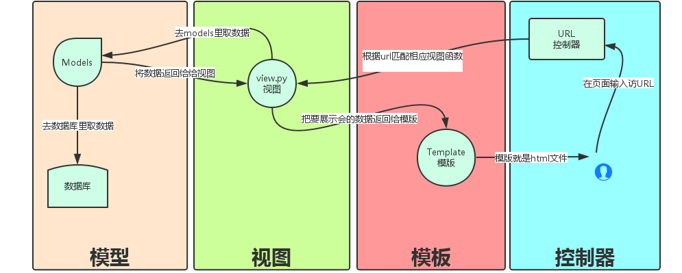

### MVC 模式

MVC 将应用程序分解为三个组成部分：mode（模型）、view（视图）、control（控制器），其中：

- M 管理应用程序的状态（通常存储到数据库中），并榆树改变状态的行为（或者叫“业务规则”）
- C 接受外部用户的操作，根据操作访问模型获取数据，并调用“视图”显示这些数据，控制器将“模型”和“视图”隔离，并成为二者之间的纽带
- V 负责把数据格式化后呈现给用户。

### MTV

Django 也是一个 MVC 框架，但在 Django 中，控制器接受用户输入的部分由框架自行处理，所以 Django 中更关注的是视图（Views），称为 MTV 模式：

- M 代表模型（Model），数据存取层，该层处理与数据相关的所有事物：如何存取、包含哪些行为以及数据之间的关系等
- T 代表模板（Template），即表现层。该层处理与表现相关的决定：如何在页面和其他类型的文档中进行显示
- V 代表视图（View），即业务逻辑层。该层包含存取模型及调取恰当模型的相关逻辑，可看作模板与模型之间的桥梁

