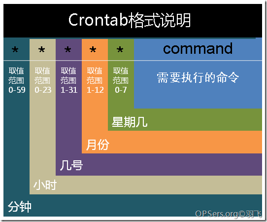

crontab 是 Linux 下执行定时任务的工具，之前偶尔需要用到时都是通过执行`crontab -e`命令或者通过 root 身份直接编辑`/etc/cron.*/`下的文件来添加定时任务。这段时间遇到了需要通过 shell 来自动添加或删除 crontab 的需求。在 shell 中无法通过`crontab -e`来与 crontab 编辑器交互，同时执行命令的人不一定有 root 身份，也无法直接编辑`/etc/cron.*/`下的文件。

经过一番实践，通过`crontab -l`配合`sed`命令来完成了这个自动添加及删除 crontab 的操作，在此记录下。

### crontab 的语法

一张很明晰的 crontab 语法图，附在这以备用



### shell 控制脚本

```bash
#!/usr/bin/env bash

CUR_PATH=$(cd "$(dirname "$0")"; pwd)

# 要定时执行的任务
TASK_COMMAND="echo 'aaa' >> /var/cron_test"
# 要添加的crontab任务
CRONTAB_TASK="*/30 * * * * ${TASK_COMMAND}"
# 备份原始crontab记录文件
CRONTAB_BAK_FILE="${CUR_PATH}/crontab_bak"

# 创建crontab任务函数
function create_crontab()
{
    echo 'Create crontab task...'
    crontab -l > ${CRONTAB_BAK_FILE} 2>/dev/null
    sed -i "/.*${TASK_COMMAND}/d" ${CRONTAB_BAK_FILE}  # 已存在任务时会被sed删除，防止重复添加
    echo "${CRONTAB_TASK}" >> ${CRONTAB_BAK_FILE}
    crontab ${CRONTAB_BAK_FILE}

    echo 'Complete'
}

# 清除crontab任务函数
function clear_crontab(){
    echo 'Delete crontab task...'
    crontab -l > ${CRONTAB_BAK_FILE} 2>/dev/null
    sed -i "/.*${SCRIPT_NAME}/d" ${CRONTAB_BAK_FILE}
    crontab ${CRONTAB_BAK_FILE}

    echo 'Complete'
}

if [ $# -lt 1 ]; then
    echo "Usage: $0 [start | stop]"
    exit 1
fi

case $1 in
    'start' )
        create_crontab
        ;;
    'stop' )
        clear_crontab
        ;;
esac

```
