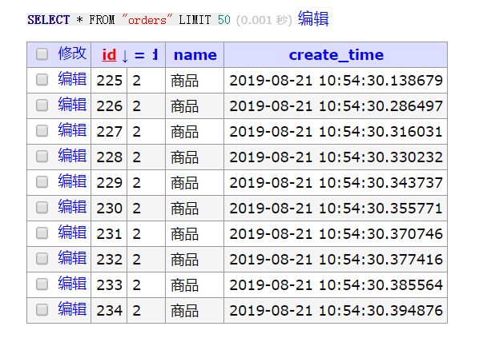

前段时间了解到了`Go-micro`这一微服务开发框架，并基于此框架的教程搭建了一套码头货运管理微服务系统。这次使用 Micro 来设计和实现了一套更接地气的秒杀系统。

对于秒杀，以及抽奖、抢红包这类系统的最大特点便是在某个时间点会瞬间涌入大量的用户，给系统造成瞬间高于平时千百倍的并发压力。针对这样的特点在设计微服务时就需要考虑一系列的措施来保障系统在高并发场景时可以稳定运行。

[完整代码地址](https://github.com/wanghaoxi3000/go-secbuy-mirco)

## 系统架构

一个经典的秒杀场景可以分为如下几个步骤

1. 创建商品的库存信息
2. 检查库存数量，满足数量就扣库存，否则失败
3. 成功扣取库存后创建订单
4. 创建支付记录

依据这个流程，可以将微服务系统分为如下几个业务模块

- 库存 stock
- 订单 order
- 支付 payment

系统架构图如下：


## 准备工作

本项目采用 Golang 语言和 Go-Micro 开发框架，使用 Postgres 数据库，为了便于快速开发，微服务的服务发现和消息机制就直接使用了 Micro 自带的机制。

### Go 和 Go-Micro

- [Golang 环境](https://golang.google.cn/)

Micro 开发框架和工具

```text
## 安装go-micro
go get github.com/micro/go-micro

## 安装micro
go get github.com/micro/micro

```

### protoc

gRPC 使用 protobuf 协议，需要安装 protoc 编译器，protoc 编译器可以在 GitHub 的 protobuf 项目下下载编译好的工具直接使用。

- [protoc compiler](https://github.com/google/protobuf/releases)

安装好 protoc 编译器后还需要安装 micro 服务对应的生成插件。

```text
go get -u github.com/micro/protoc-gen-micro
go get -u github.com/micro/protobuf/protoc-gen-go

```

### Postgres

我在测试环境中搭建了 docker 服务，因而可以通过 docker 快速启动一个 Postgres 实例。

```text
docker run --name postgres-dev -d --restart=always -p 5432:5432 -e POSTGRES_PASSWORD=postgres123 postgres:11

```

为了方便管理，同时启动了一个 adminer 服务。

```text
docker run --name adminer -d --restart=always -p 10080:8080 adminer

```

创建一个 dev 用户和 secbuy 数据库。

```text
su potgres
createuser -P -e dev
psql -U postgres
CREATE DATABASE secbuy OWNER dev;
GRANT ALL PRIVILEGES ON DATABASE secbuy to dev;

```

## 服务开发

有了大体的架构思路后，我们可以开始开发每个微服务了，这里通过 Go-Micro 提供的工具，我们可以快速搭建起一个微服务的开发模板，同时基于为了尽量去复用代码，可以将微服务的配置相关提取出来，作为一个公共的功能让其余微服务来调用。

因此我们这里先搭建一个负责读取配置数据的 basic 模块：
[代码路径](https://github.com/wanghaoxi3000/go-secbuy-mirco/tree/master/basic)

```text
.
├── basic.go            // basic 模块入口, 提供初始化接口
├── config
│   ├── config.go       // 读取config配置文件
│   ├── postgres.go     // postgres配置数据结构
│   └── profiles.go     // 配置文件属性数据结构
├── db
│   ├── db.go           // 数据库orm初始化流程
│   └── postgres.go     // postgres初始化流程
├── go.mod
└── go.sum

```

每个微服务通过引用 basic 模块即可以完成读取自身的配置文件并初始化。

完成 basic 的逻辑编写后，通过 Go-Micro 的 micro 工具即可自动生成微服务代码模块，开始微服务的开发。这里以 stock 库存服务为例，执行如下命令，风别建立 stock-srv 和 stock-web 服务，分别提供 stock 服务的业务逻辑和 web 接口。

```text
micro new github.com/wanghaoxi3000/go-secbuy-mirco/stock-srv --namespace=go.micro.secbuy --alias=stock --type=srv

micro new github.com/wanghaoxi3000/go-secbuy-mirco/stock-web --namespace=go.micro.secbuy --alias=stock --type=web

```

生成的代码模板目录如下：

- stock-srv

```text
.
├── Dockerfile
├── handler
│   └── stock.go
├── main.go
├── Makefile
├── plugin.go
├── proto
│   └── stock
│       └── stock.proto
├── README.md

```

- stock-web

```text
.
├── Dockerfile
├── handler
│   └── handler.go
├── html
│   └── index.html
├── main.go
├── Makefile
├── plugin.go
├── proto
│   └── stock
│       └── stock.proto
└── README.md

```

可以看见代码模板不但帮我们生成好了基本的代码开发文件，还有 Makefile、Dockerfile、README 这些一般项目所需的辅助文件也一并生成好了。

### stock 服务

这里从 stock 库存服务开始整个项目的开发，先在 Postgres 数据库中建立 stock 服务需要的表。注意为了保证高并发下，数据可能出现的超卖情况，在 stock 表中除了必要的数据字段，还添加了 version 乐观锁字段。

```sql
CREATE TABLE stock(
    id SERIAL NOT NULL PRIMARY KEY,
    name VARCHAR(50) NOT NULL,
    count INTEGER NOT NULL,
    sale INTEGER NOT NULL,
    create_time TIMESTAMP NOT NULL DEFAULT now(),
    version INTEGER NOT NULL DEFAULT 0
);

COMMENT ON COLUMN stock.id IS '主键';
COMMENT ON COLUMN stock.name IS '名称';
COMMENT ON COLUMN stock.count IS '库存';
COMMENT ON COLUMN stock.sale IS '销量';
COMMENT ON COLUMN stock.create_time IS '创建时间';
COMMENT ON COLUMN stock.version IS '乐观锁';

```

在本项目中，为了快速完成数据库的开发，引入了 gorm 库，在代码的 model/stock/stock.go 需要定义对应的

有了数据表后，可以开始编写 proto 文件，定义 stock 微服务可以提供的接口。在 sotock 微服务中提供三种接口：

- CreateCommodity 创建商品信息
- GetCommodity 通过 ID 查询商品信息
- Sell 对指定 ID 的商品进行销存操作

服务的接口定义如下：

```text
service StockService {
    rpc CreateCommodity (Commodity) returns (Response);
    rpc GetCommodity(GetRequest) returns (Response);
    rpc Sell(GetRequest) returns (Response);
}

```

在 proto 文件中还需对这些接口进一步定义各个类型的字段，完成后通过已编写的的 Makefile 文件，在终端执行`make proto`即可生成对应的 go 代码文件 stock.pb.go 和 stock.micro.go 的文件。里面定义了 proto 文件中对应的 go 代码数据接口和接口。

为了方便数据库的开发，在 basic 模块中引入了 gorm，可以通过 gorm 来完成 model 的开发。在 stock 服务的/model/stock/stock.go 中可以根据需要定义 stock 表对应的 struct，方便 gorm 来使用。

```text
type stockModel struct {
	ID         int32
	Name       string
	Count      int32
	Sale       int32
	CreateTime time.Time `gorm:"DEFAULT:now()"`
	Version    int32
}

```

同时在此文件中，定义了一个`service struct`，用来实现本服务各接口功能的数据库对应的 crud 功能。在`func (s *service) SellCommodityByID(id int32) (commodity *proto.Commodity, err error)` 方法中，实现了本服务最核心的使用乐观锁销存操作。

```text
// 乐观锁销存
if row := o.Model(&model).Where("version = ?", model.Version).Updates(
	map[string]interface{}{
		"sale":    model.Sale,
		"version": model.Version + 1,
	}).RowsAffected; row == 0 {
	return nil, errors.New("commodity info timeout")
}

```

最后在/handler/stock.go 中为微服务实现 proto 文件中定义的三个接口，stock-srv 微服务的开发工作便基本完成了。通过`make build`即可编译生成微服务的可执行文件。完成后的 stock-srv 结构：

```text
.
├── conf
│   ├── application-db.yml
│   └── application.yml
├── Dockerfile
├── go.mod
├── go.sum
├── handler
│   └── stock.go
├── main.go
├── Makefile
├── model
│   ├── model.go
│   └── stock
│       ├── stock.go
├── plugin.go
├── proto
│   └── stock
│       ├── stock.micro.go
│       ├── stock.pb.go
│       └── stock.proto
├── README.md
├── stock-srv
└── utils
    └── createTabel.sql

```

stock 服务同时还提供了 stock-web 来提供 web 接口的 stock 创建和查询服务。初始化的模板基本已完成了大部分的开发工作。基本上只需要在 handler/handler.go 中引入 stock 的服务，编写好对应的 web 接口方法即可。

```text
// 初始化 StockService
import stock "github.com/wanghaoxi3000/go-secbuy-mirco/stock-srv/proto/stock"

var (
	serviceClient stock.StockService
)

func Init() {
	serviceClient = stock.NewStockService("go.micro.secbuy.srv.stock", client.DefaultClient)
}


```

这里需要注意的是，调用 stock 服务需要引用 stock-srv 模块的 proto 文件，对于还在开发中的项目，对应的文件可能还没发布到代码库中，这时一个是可以将 stock-srv 的 proto 文件复制一份到 web 服务中来使用，但一旦 srv 中的 proto 文件有变动 web 的文件也要同步变更。更方便的是是使用 go mod，可以直接引用 stock-srv 的代码库路径，同时在`go.mod`中添加：
`replace github.com/wanghaoxi3000/go-secbuy-mirco/stock-srv => ../stock-srv`将代码库路径转换为本地相对路径即可。

### order 服务

order 服务是秒杀中的承上启下的服务，通过提供`CreateOrder`的接口和 order-web 中的 web 服务，接收参与秒杀的用户调用请求，完成如下的功能：

1. 查询指定 ID 的商品信息
2. 查询到指定 ID 信息后，检查商品此时的订单和库存信息，若订单已等于库存，则商品已销售完
3. 若商品订单尚小于库存，则调用 stock 服务的`SellCommodityByID`接口，执行销存操作
4. 根据销存的结果，创建订单数据和发送创建支付记录消息，将结果返回给调用用户

存放订单数据的数据库 orders 表结构定义如下：

```text
CREATE TABLE orders (
    id SERIAL NOT NULL PRIMARY KEY,
    sid INTEGER NOT NULL,
    name VARCHAR(50) NOT NULL DEFAULT '',
    create_time TIMESTAMP NOT NULL DEFAULT now()
);

COMMENT ON COLUMN orders.id IS '主键';
COMMENT ON COLUMN orders.sid IS '库存ID';
COMMENT ON COLUMN orders.name IS '商品名称';
COMMENT ON COLUMN orders.create_time IS '创建时间';

```

order 服务代码的开发的流程和 stock 大同小异，在创建完模板后，主要的不太的是在 model 的`CreateOrder`方法中创建订单记录时，需要通过 stock 服务客户端调用 Sell 方法来完成销存服务。

```text
func (s *service) CreateOrder(id int32) (*proto.Order, error) {
	rsp, err := stockClient.Sell(context.TODO(), &stockSrv.GetRequest{Id: id})
	if err != nil {
		log.Logf("[model] Sell 调用库存服务时失败：%s", err.Error())
		return nil, err
	}
	if !rsp.GetSuccess() {
		return nil, errors.New("销存失败")
	}

	o := db.GetDB()
	model := order{
		Sid:  id,
		Name: rsp.GetCommodity().GetName(),
	}
	o.Create(&model)
	orderProto := &proto.Order{
		Id:         model.ID,
		Name:       model.Name,
		CreateTime: model.CreateTime.Format("2006-01-02T15:04:05"),
	}

	return orderProto, nil
}

```

同时在成功销存后，会向 payment 服务 pub 一个创建支付记录的消息，创建 publisher 的方法很简单，通过`publisher := micro.NewPublisher("payment.payevent", service.Client())`即可创建一个`payment.payevent`主题的 Publisher，此后通过`PaymentPublisher.Publish()`方法即可发布消息。

### payment 服务

payment 服务主要在接收到用户成功参与秒杀的消息后，创建此用户对应的订单支付记录，存放数据的 payments 表结构如下：

```text
CREATE TABLE payments (
    id SERIAL NOT NULL PRIMARY KEY,
    sid INTEGER NOT NULL,
    name VARCHAR(50) NOT NULL DEFAULT '',
    state INTEGER NOT NULL DEFAULT 1,
    create_time TIMESTAMP NOT NULL DEFAULT now()
);

COMMENT ON COLUMN payment.id IS '主键';
COMMENT ON COLUMN payment.sid IS '订单ID';
COMMENT ON COLUMN payment.state IS '订单状态';
COMMENT ON COLUMN payment.name IS '商品名称';
COMMENT ON COLUMN payment.create_time IS '创建时间';

```

payment 服务提供 PayOrder 接口，通过 payment-web 服务的 web 接口，用户可通过此服务完成支付服务。本微服务需要注意的是通过`micro.RegisterSubscriber("payment.payevent", service.Server(), paymentHandle.Process)`来订阅`payment.payevent`主题接收消息，和对应的处理函数。orders 表中的`state`表示了支付和未支付订单状态，用户通过 payment-web 的 rest api 完成支付操作后 state 变为 1 的记录表示用户支付成功。

## 测试

为了方便测试，这里也编写了一个[测试程序](https://github.com/wanghaoxi3000/go-secbuy-mirco/tree/master/test)，通过 Go 语言创建指定数量的协程在同一时间发起秒杀请求，来模拟整个秒杀过程。

### 创建商品信息

在运行启动整个微服务后，通过 micro 工具执行如下命令来创建一条商品信息：

```text
 micro --registry=mdns call go.micro.secbuy.srv.stock StockService.CreateCommodity '{"name":"商品","count":10,"sale":0}'

```

可以看到数据库中多了一条商品信息


### 模拟秒杀

将测试程序的 config.json 配置文件配置 count 项目配置为 500，同时创建 500 个协程来模拟秒杀过程，执行完毕后，测试程序报告 500 个协程中有 10 个成功完成了秒杀过程，其余则失败了。


此时 orders 和 payments 表中也正好多了 10 条订单记录：




### 模拟支付

此时通过 postman 向`/payment/payorder`接口发送一条`{"id":2}`的数据，模拟支付此条订单，根据结果代表已成功支付此订单，payments 表中对应 ID 的 state 字段也已改变。


## 完整秒杀系统还应具备的功能

本文侧重使用 Go-Micro 搭建一个秒杀的微服务系统框架，只是完成了一个基础的后台功能。当然对于真正的秒杀系统还是远远不够的。

在秒杀系统的开发中还应当注意以下等环节：

1. 启动多个服务通过负载均衡将流量分布到多个应用中，缓解每台机器的压力
2. 拦截重复调用接口等异常流量
3. 加入 Redis 等缓存，将秒杀商品的信息放到缓存中，避免直接查询数据库，缓解数据库的压力
4. 对于类似秒杀商品发货等的非常耗时的操作，可以使用基于 MQ 来限流削峰
