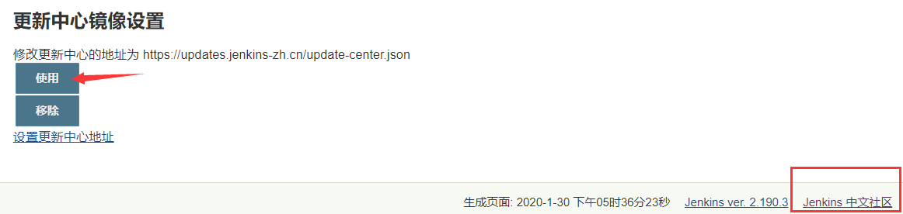
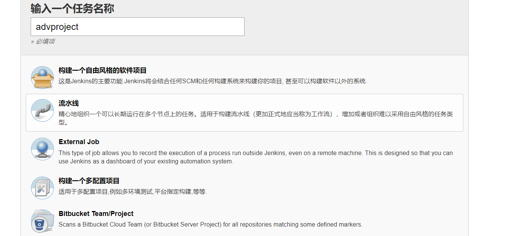
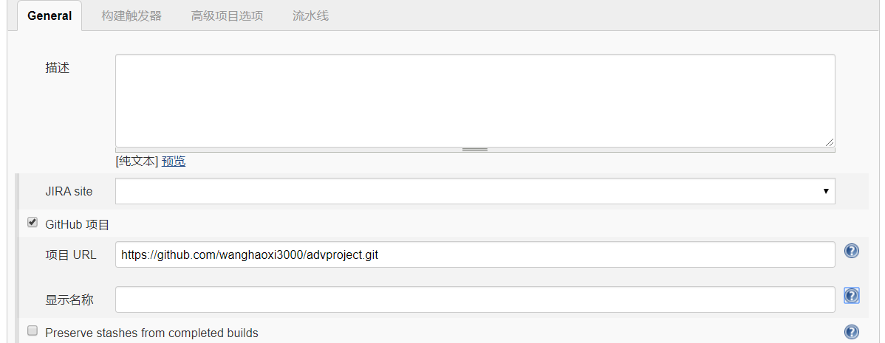
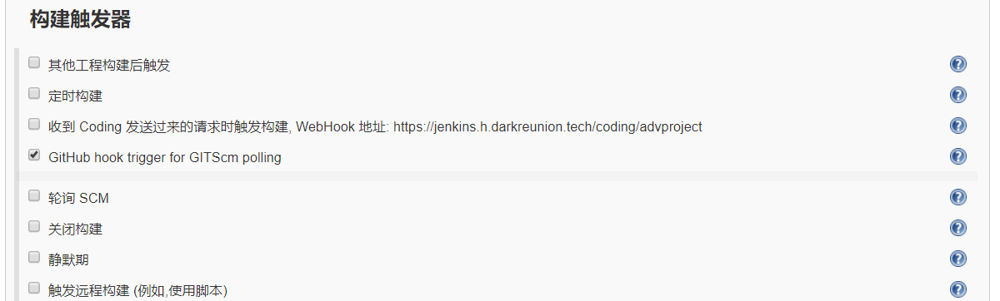
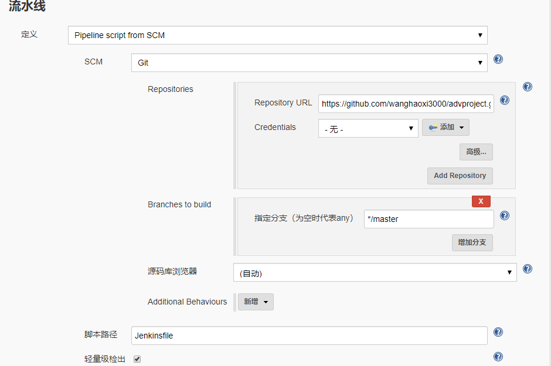
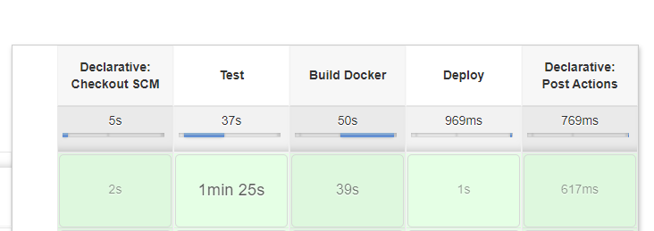
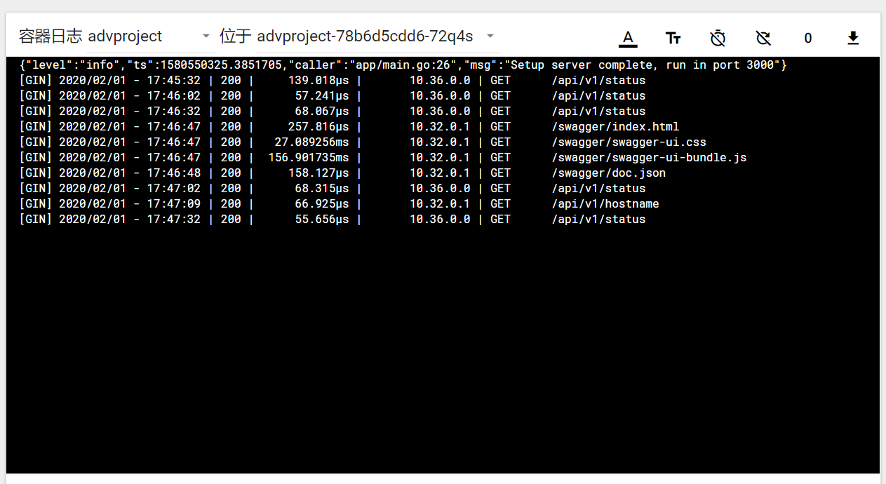
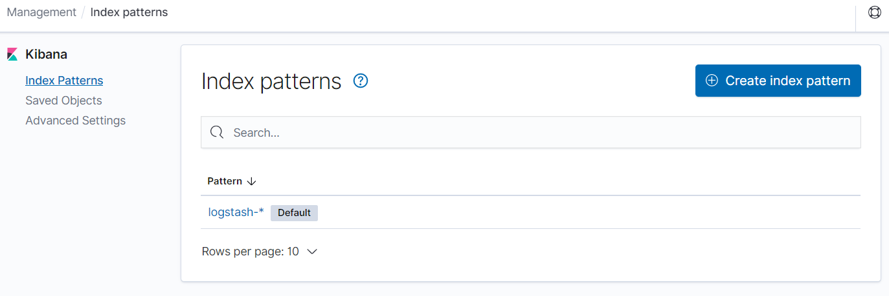
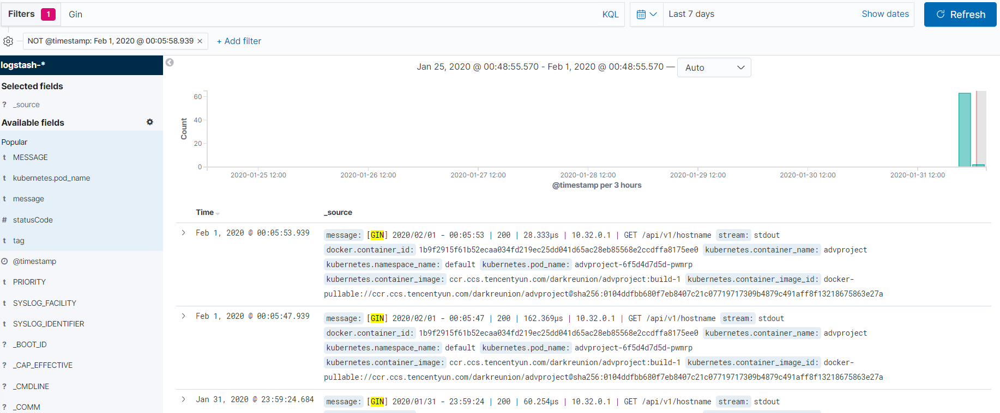

在后端的开发领域，各类开发框架都已经很多，在开发项目时可以根据不同的需要和需求选择合适的开发框架。然而在需要开发一个完善的工程化项目时，仅仅一个后端开发框架是不够的，还面临着在对开发项目的快速迭代中进行测试，部署，监控等问题。为了解决这些问题，DevOps 的开发模式应运而生。

基于个人对 DevOps 的理解，搭建了一个基于 Gin 的开源后端项目来实践下 DevOps 的各个概念：[https://github.com/wanghaoxi3000/advproject](https://github.com/wanghaoxi3000/advproject)。

DevOps 是一个宽泛的概念，这个项目也只是抛砖引玉，在测试环境下串联起各个 DevOps 的基础工具，存在的不足欢迎指出，一起学习和交流。

## 如何构建 DevOps 模式的项目

什么是 DevOps 呢，对 DevOps 比较官方的定义如下：

> DevOps 集文化理念、实践和工具于一身，可以提高组织高速交付应用程序和服务的能力，与使用传统软件开发和基础设施管理流程相比，能够帮助组织更快地发展和改进产品。这种速度使组织能够更好地服务其客户，并在市场上更高效地参与竞争。

可以说 DevOps 是一组过程、方法与系统的统称，涉及到开发中的组织架构，开发工具，基础架构等等方面。但它的一个核心便是强调通过各类自动化的工具来自动执行软件交付和基础架构更改流程，从而快速、频繁且更可靠地构建、测试和发布软件。这里也将主要围绕这个思想来构建 DevOps 的项目。

在这个基础项目中，将主要围绕如下部分的 Devops 实践进行构建：

- 持续集成：一种软件开发实践经验，开发人员会定期将他们的代码变更合并到一个中央存储库中，之后系统会自动运行构建和测试操作。
- 持续交付：自动构建和测试代码更改，并为将其发布到生产环境做好准备，实现对持续集成的扩展。
- 基础设施即代码：使用基于代码的工具来连接基础设施，并且能够以处理应用程序代码的方式来处理基础设施。基础设施和服务器由代码进行定义。
- 监控和日志记录：组织对各项指标和日志进行监控，以了解应用程序和基础设施性能如何影响其产品的最终用户体验。

整个项目的开发流程如下：


## 开发工具及环境

要完成从开发到部署的一系列的流程，当然也少不了各种自动化工具及环境的支持，本项目所使用的环境如下：

1. 代码开发环境 Go 1.13
2. Github 账户
3. 容器仓库，本项目使用腾讯云容器服务
4. Jenkins 2.190
5. Kubernetes 本项目使用基于 k8s v1.16.1 的三节点集群

## DevOps 项目开发流程

通过[advproject](https://github.com/wanghaoxi3000/advproject)这个基于 Gin 的后端项目的代码更新、提交、完成对项目的自动化测试、打包、部署的流程。

### 后端项目

[advproject](https://github.com/wanghaoxi3000/advproject)项目主要包含了如下部分：

- 接口文档 [swag](https://github.com/swaggo/swag)
- 日志 [zap](https://github.com/uber-go/zap)
- 配置 [godotenv](https://github.com/joho/godotenv)
- docker 容器化文件 [Dockerfile](https://github.com/wanghaoxi3000/advproject/blob/master/Dockerfile)
- Jenkinsflie [Jenkinsfile](https://github.com/wanghaoxi3000/advproject/blob/master/Jenkinsfile)
- Kubernetes 部署文件 [deployment-template.yaml](https://github.com/wanghaoxi3000/advproject/blob/master/deployment-template.yaml)

整个代码的结构如下

```text
.
├── Dockerfile                  // Docker镜像打包文件
├── Jenkinsfile                 // Jenkins CI 定义
├── README.md
├── api
│   └── status.go               // 运行状态接口
├── config
│   ├── base.go                 // 基础配置
│   └── init.go                 // 配置模块初始化
├── deployment-template.yaml    // Kubernetes部署模板文件
├── docs                        // swag 接口文档
│   ├── docs.go
│   ├── swagger.json
│   └── swagger.yaml
├── go.mod
├── go.sum
├── main.go
├── serializer
│   └── common.go               // 接口格式定义
├── server
│   └── router.go               // 路由
├── test
│   └── status_test.go          // 测试代码
└── util
    └── logger.go               // 日志模块

```

### Jenkins CI 配置

在代码有更新时，提交代码到 Github 后，Jenkins 会收到代码 Github 推送通知，拉取代码并读取代码中的 Jenkinsfile 文件来运行指定的流程。

可通过如下命令 docker 来快速运行一个 Jenkins。为了在 Jenkins 容器中使用`docker`命令，将 docker 命令映射到了容器中，同时指定以 root 身份来运行容器。

```text
docker run --name=jenkins_lts -d -u root -v jenkins_home:/var/jenkins_home -v /var/run/docker.sock:/var/run/docker.sock -v $(which docker):/bin/docker -p 8080:8080 -p 50000:50000 -e JAVA_OPTS=-Duser.timezone=Asia/Shanghai jenkins/jenkins:lts

```

在 Jenksin 容器启动完成并成功登陆后，可以点击主界面右下角的`Jenkins 中文社区`链接，然后更新中心镜像设置为国内源，加快插件的下载速度。



### 环境配置

本项目中主要使用到这些 Jenkins 插件，可以在插件管理页面中搜索安装：

- Blue Ocean 方便和 Pipeline 搭配使用
- Kubernetes Cli Plugin 通过 kubectl 操控 k8s 集群

在执行部署的推送镜像、通知等过程中，需要使用到不方便暴露在代码中的密钥，如何在 Jenkinsfile 中使用这些密钥呢？可以提前在 Jenkins 的凭据管理中录入这些密钥，Jenkinsfile 中以变量的方式进行调用。这里配置了如下的凭证：

- tcloud-docker-reg 镜像仓库登录密钥
- kubctl-config kubectl 密钥
- PUSH_KEY 基于 Server 酱通知推送的密钥

### 建立项目

通过 Jenkinsfile 文件以代码声明的方式来定义持续集成的流程，需要在 Jenkins 中建立一个 Pipeline 流水线项目。

选择新建任务，输入任务名建立一个流水线项目：



General 选项卡中勾选 GitHub 项目，并填入项目地址：



在代码推送后，使用 GitHub 的 webhook 功能推送代码更新消息，需要在构建触发器中勾选`GitHub hook trigger for GITScm polling`：



此后还需要在 GitHub 的代码项目中配置 webhook 推送更新的地址，相关文章已有很多，这里就不再累述了。

最后，在流水线配置中填入代码地址：



指定分支中默认为`*/master`，表示拉取 master 分支的更新，如果想要拉取指定 tag 的代码。可以按这样的格式来配置：`+refs/tags/*:refs/remotes/origin/tags/*`。

运行一下，可以看见 Jenkins 开始启动并运行了。



通过 Blue Ocean，可以看见更详细的运行图。


### 推送结果

推送的结果将通过[Server 酱](http://sc.ftqq.com/3.version)推送到绑定的微信中。Server 酱是一个很方便的微信推送服务，只需要绑定下 GitHub 账户，之后请求对应地址即可向微信推送消息。推送的信息包含本次集成的结果和代码更新的记录，集成结果在 Jenkinsfile 中可以通过`${currentBuild.result}`来获取。代码更新记录 Jenkins 没有对应的变量，可以通过运行`git log --pretty=format:\'%h - %an,%ar : %s\' --since=\'1 hours\' | head -n 1`来获取代码最近一次的变更记录。

### 部署到 Kubernetes

项目每次更新完成，同通过 Jenkins 拉取代码测试无误后，将会把项目打包成镜像并以`build-${BUILD_NUMBER}`作为 tag，并推送到腾讯云的私有镜像仓库中，`${BUILD_NUMBER}`是 Jenkins 运行任务时的环境变量，表示运行本次集成任务的序号。之后以项目中`deployment-template.yaml`为模板，替换对应变量后部署到 k8s 集群上。

Jenkins pipeline 执行完成后登录集群节点，运行`kubectl get pods`，可以看到刚刚部署上的项目，已全处于了 Running 状态了。

```text
NAME                          READY   STATUS    RESTARTS   AGE
advproject-6f5d4d7d5d-pwmrp   1/1     Running   0          33s
advproject-6f5d4d7d5d-zscz2   1/1     Running   0          19s

```

为了便于测试，快速访问集群中的服务，可以按如下配置启动一个`NodePort`的 Service，将 Pod 的端口暴露出来。

```text
apiVersion: v1
kind: Service
metadata:
  name: advproject-svc
spec:
  type: NodePort
  ports:
  - port: 3000
    targetPort: 3000
    protocol: TCP
  selector:
    app: advproject

```

通过`kubectl get service`可以看到 NodePode 分配的端口号为 30942：

```text
NAME             TYPE        CLUSTER-IP       EXTERNAL-IP   PORT(S)          AGE
advproject-svc   NodePort    10.110.152.165   <none>        3000:30942/TCP   25d

```

在节点上运行`curl localhost:30942/api/v1/hostname`，可以查看到项目对应的 hostname，由于部署的 Deployment 文件中设置的`replicas: 2`，项目部署的节点数为 2，请求的 hostname 也会随机出现两种。

### 日志监控

进入 k8s 的 dashboard，在侧边栏选择容器组，可以看见运行项目的两个容器的，点击日志可以在网页中分别查看每个容器的控制台日志。这里可以看到刚刚请求 hostname 接口的日志，以及 k8s 在定时请求 status 接口进行健康检查。



为了更好的收集和分析日志，这里将通过 k8s 的 ELK 插件，来统一收集日志。克隆 k8s 对应版本的代码，使用 k8s 项目`/cluster/addons/fluentd-elasticsearch`目录下的示例代码，使用`kubectl apply -f .`命令可以快速部署一个 ELk 插件。

部署完成后，登录 kibana，创建一个默认的 logstash-\* pattern。



稍等一会，就可以`Discover`菜单下看到 ElasticSearch logging 中汇聚的日志，在 Filters 中搜索 Gin，可以看到本项目的日志了。



## 总结

至此，一个以 DevOps 模式的项目开发流程便大致完成了。当然这个过程也还有很多可以继续完善的地方，比如生成更详细的代码测试报表、使用 kibana 生成日志报表、监测代码中的错误日志并报警等等。通过 DevOps，将开发、测试、运维这些步骤紧密联系了起来，使得构建、测试、发布软件能够更加地快捷、频繁和可靠。除了这些技术和工具，DevOps 也更需要组织中各个部门之间的进行良好的沟通、协作与整合。在实际开发中，需要通过各个部门的分工合作，开发人员编写业务和单元测试代码；测试人员设计测试用例，关注代码测试报告；运维人员设计 Kubernetes 部署模板，监控系统及日志数据，这样才能发挥 DevOps 的最大效力，更好地为客户服务并在市场中更有竞争力。
