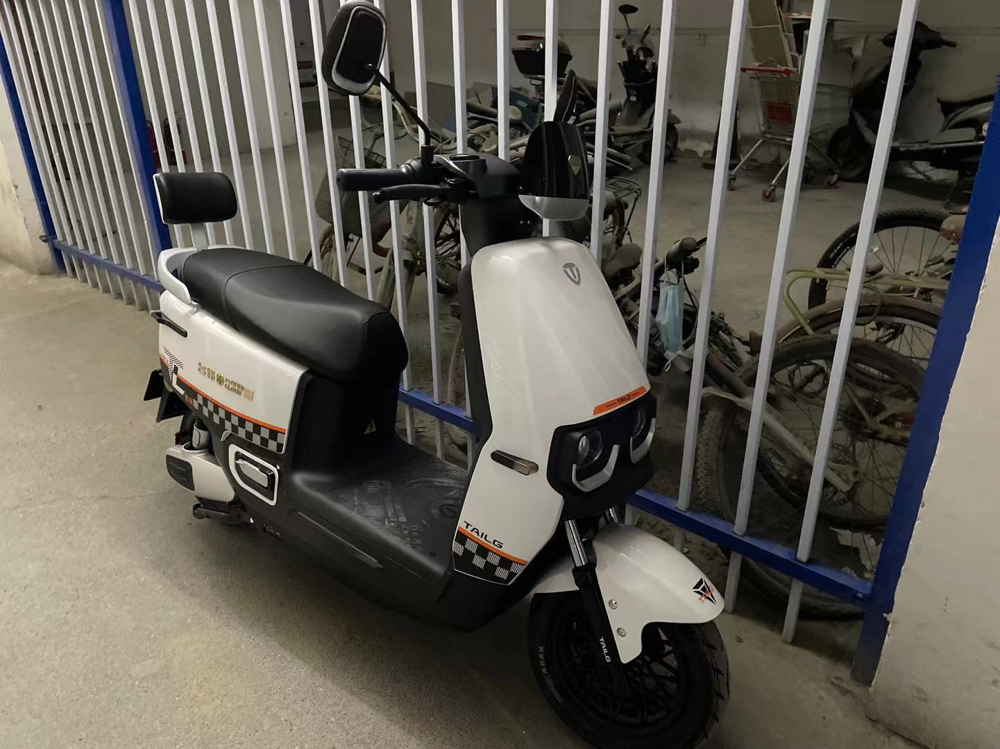

## 人生第一台电摩

成功增驾摩托 D 照后，入手了人生第一台电摩，台铃赤兔。本来想买台铃的萌苏，不过家附近的店没有网上的款式，就看了这款。造型说不上多好看，胜在比较有特点吧，前后都有眼睛一样的双灯，两侧还有一排蓝灯，很有氛围，前轮的大碟刹也挺霸气，白色款还挺有兔子的感觉，车架也比较大，有赤兔马的气势。

其实我对电摩的需求不是很高，上班通勤的距离比较远，还是地铁比较合适，也就偶尔去近点的地方可以代代步或者闲暇时去兜兜风，就把它当做一个大玩具吧，想要买款比较智能点的，也有更多的趣味，一直听说九号和小牛的智能化不错，不过溢价太高，选购台铃这款时老板说可以连手机，用手机来解锁啥的，买下后连上手机试了试，槽点满满... 初始化就各种问题搞了半天，连接状态也是经常不稳定，出现了一次半路突然断电情况，感觉和这个连接问题有关，用了几天就卸载不消再用了，有一种传统企业强行转型互联网的味道... 瞬间感觉九号小牛有一些溢价也是有道理的。

## 本周见闻

### 苹果：为了安全让 M2 吃灰

Mac 的 SIP 机制对性能存在影响，这个机制会请求苹果的服务器来做安全校验。但由于国内的网络问题，特别是开发时需要编译和运行各类第三方软件时存在较大影响，可以通过修改开发者策略来提升开发速度。

[https://catcoding.me/p/apple-perf/](https://catcoding.me/p/apple-perf/)

### 信息管理工具 huntly

一款个人开源的信息管理工具，很有创意，我也收藏了很多 RSS 源，也有各种稍后读的需求，这款软件整合了这些需求，准备体验下试试。

[https://coolc.substack.com/p/022-huntly](https://coolc.substack.com/p/022-huntly)

### 代码提示工具 Codeium

Out 了，竟然才知道这款代码提示 AI，迫于 Github Copilot 收费，转到了 Tabnine，Tabnine 的免费版本实在是聊胜于无，能提示的太少了，试了下这款免费的 AI，不说比肩 Github Copilot，比 Tabnine 的免费版实在是强大很多了，已全面替换。

[https://codeium.com/](https://codeium.com/)

## 追番

### 虚构推理 SE02

会长杀妻案，千层饼一样的故事，感觉很精彩，挺期待最后虚构出来杀妻谜底。不过阿 B 停更了，可恶...
