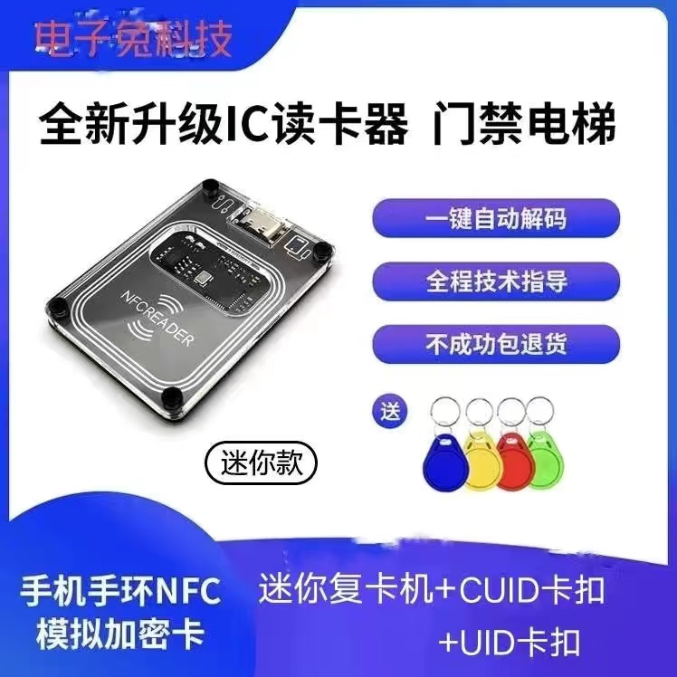

## 理想的 Blog 系统

又是很久一段时间没有来写博客了，虽说平常的工作繁忙是一个原因，不过我平时笔记这些还是记得不算少，为什么这些记录没有转化为博客内容呢。我总结了一些原因：

- 笔记的内容较为碎片，要输出为博客的话，还需要进一步的整理，懒得整理就只能躺在笔记中了
- 虽然已经折腾了好几次，但我还是对目前博客的主题不咋满意，激发不了我写博客的动力，想改造下又觉得太麻烦（主要还是前端技术栈不过关）
- 近年来我开始使用 notion 这一类云笔记应用，目前使用了[wolai](https://www.wolai.com/)这一款国内的相似应用，想记点什么了只需要打开网页即可记录，所见即所得，非常方便，但我想发布一篇博客的话，以我目前使用的 hugo 为例，在一台新电脑上发布文章需要有这些步骤：
  - git clone 我的博客
  - 使用一款文本编辑器（我主要用 vscode）编写文章
  - 编写完成后，若想本地预览，本地也需要安装 hugo 程序，这一步可选
  - 发布文章，等待 GitHub Action 执行完成，推送到服务器并刷新 CDN，估计一刻钟左右后，可以在网站上看到新发布的文章

总之，想发布一篇博文的流程还是太麻烦了，很消磨想表达的热情，我的博客基本就是平常笔记的记录，作为笔记那么就会有疏忽，错误，以及想要补充的点。 理想中的博客系统我希望可以有这些：

- 方便的编辑器，所见即所得
- 插件式的主题定制，可以通过拖拽来自定义主题
- 支持 Git 存储，可以保存文章的历史记录
- 支持生成静态博客，便于部署
- 可以私有化部署，开源，生态良好

在这里 YY 下，目前我还没发现这样的一套系统，功能点也是我个人的偏好，不过我会保持关注，持续探索如何优雅的的发布博客。

另外对于懒的问题，其实我个人的还是喜欢随便写点什么的，最近也订阅了一些很不错的周刊，感觉这是个很不错形式，以后也勉励自己保持每周多少能写一篇小周刊吧，这一篇也算是个开始吧。

## 本周动态

### 苹果手机 NFC 卡解决方法

自从转到 Iphone 阵营后，便失去了手机 NFC 模拟门卡这一实用功能，我的小区大门和公司门禁都是使用的 IC 卡，用安卓手机时通过模拟门卡这一功能可以很方便的用手机来开门。由于苹果手机不开放模拟门卡，之前购置了一个小米手环来专门模拟门卡，这一曲线救国方案也还算方便，带个手环偶尔看看时间也比较方便。不过手环毕竟还是没有手机带的那么随身，有时下楼吃饭或者手环放着充电啥的，回来才突然想起没有带，如果手机能刷下卡的话还是非常方便的。

最近在 PDD 中购买了一个 30+的 PCR532 的 NFC 刷卡器，加上几块钱的 NFC 卡贴，可以把门卡复制到卡贴中，然后把卡贴贴苹果手机背后到或者夹到手机壳中间，这样便让苹果手机也有了刷门卡的能力，成本也不算高，相比纯手环也更方便了一点。另外这种刷卡器还支持复制加密的门卡，虽说不是一定能成功，但是成功率也是挺高的了。

PDD 上卖这种机器的还挺多的，除了基本的复制门卡的功能，一般还会附加云备份，云解密等需要开 VIP 的附加功能，这也算是一种程序员挣外块的方式了吧。

### Chrome 沉浸式翻译插件

谷歌插件地址：[沉浸式翻译](https://chrome.google.com/webstore/detail/immersive-translate/bpoadfkcbjbfhfodiogcnhhhpibjhbnh)

一款强大的 Chrome 翻译插件，可以在显示原文的同时显示翻译，支持多种翻译 API，翻译速度快还便于对照着学习英语，真是良心插件，吐血推荐。作者的[Buzzing](https://www.buzzing.cc/)网站也是我常常逛的一个网站，可以快速的了解一些国外资讯，内容很丰富。

