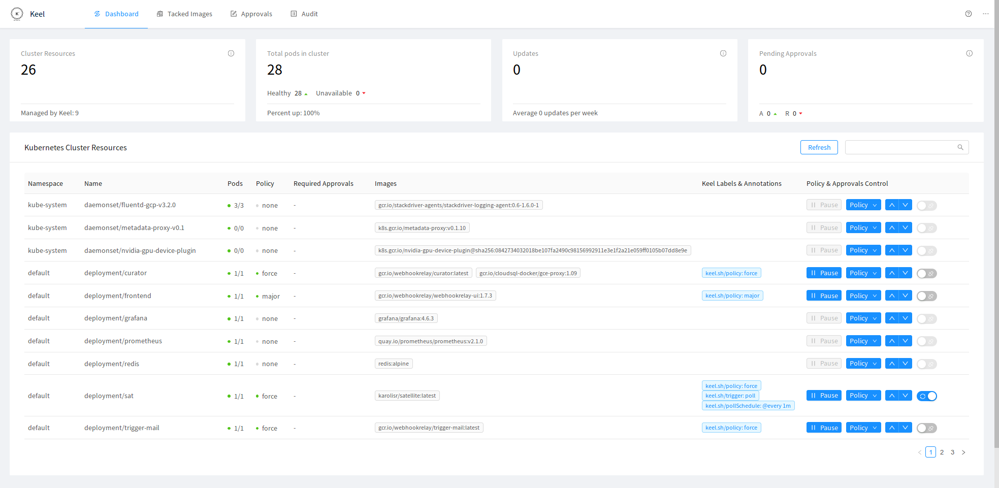
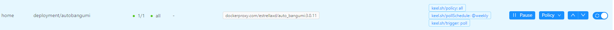
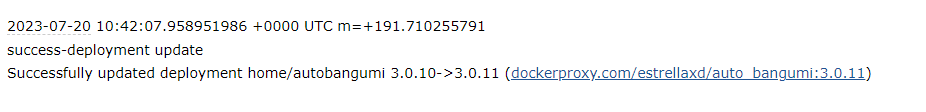

当我们在自己的服务器上使用 Docker 部署了一些有用的容器镜像时，一般可以使用 [watchtower](https://github.com/containrrr/watchtower) 来自动更新我们的镜像版本。但是如果使用的是 K8S，有没有工具可以像 watchtower 一样来自动更新 K8S 中的容器镜像版本呢，最近发现了 [Keel](https://github.com/keel-hq/keel) 这款工具可以做同样的事。

# 部署

Keel 的部署可以参考官方文档：[https://keel.sh/](https://keel.sh/)

不过官方文档中，Deploying with kubectl 的方式使用的 `sunstone.dev` 似乎已经停止维护，通过文档介绍的方式已无法获取到 YAML 文件，使用此方式需要自行在 Github 仓库中获取部署需要的 YAML 并替换相关变量。

我使用的是 Helm 的方式来部署，主要步骤：

**添加 chart repo**

```bash
helm repo add keel https://charts.keel.sh
helm repo update
```

**部署 Keel**

```bash
helm upgrade --install keel --namespace=keel --create-namespace keel/keel -f values.yaml
```

**values.yaml 示例**

```yaml
# 关闭 Helm Provider
helmProvider:
  enabled: false

# 开启 Dashboard
basicauth:
  enabled: true
  user: "admin"
  password: "admin321"

# 开启 EMail 通知
mail:
  enabled: true
  from: "email@mail.com"
  to: "email@mail.com"
  smtp:
    server: "smtp.mail.com"
    user: "email@mail.com"
		pass: "password"
```

这里由于不需要使用 Keel 更新 Helm 的能力，所以关闭了默认的 `HelmProvider` 。通过配置 `basicauth` 可以打开 Keel 的 Dashboard。`mail` 配置项可以在容器更新时通过邮件发送通知。

# 使用

在上一步部署的时候配置了 `basicauth`，通过建立对应的 nodeport service 或其他对应的方式暴露 Keel 的 9300 端口，即可访问到 Keel 的 Dashboard，首页显示了 K8S 中部署的各类资源，可以在这里配置需要自动更新的资源：



点击每行最后的开关，Keel 即可开始监控这个资源的容器镜像，开启自动更新。

## 更新策略

Keel 支持配置的不同的更新策略：

- **all**: update whenever there is a version bump or a new prerelease created (ie: `1.0.0` -> `1.0.1-rc1`)
- **major**: update major & minor & patch versions
- **minor**: update only minor & patch versions (ignores major)
- **patch**: update only patch versions (ignores minor and major versions)
- **force**: force update even if tag is not semver, ie: `latest`, optional label: **keel.sh/match-tag=true** which will enforce that only the same tag will trigger force update.
- **glob**: use wildcards to match versions, example:

当容器镜像版本遵循 semver 版本编号进行发布时，可以配置 all 到 patch 这一类策略来灵活的更新版本，其他如使用 `latest` 的镜像可以使用 force 或者 glob 这一类策略来强制更新或匹配特定的版本。

## 触发器

Keel 通过各类 webhook 和 poll 的方式来检查镜像的版本，webhook 的方式可以在容器镜像仓库或者对应的代码仓库更新时主动通知 Keel 来更新镜像，不过我需要使用 Keel 来更新的镜像一般都是第三方的，没有配置 webhook 的权限，需要使用 poll 轮询的方式来检查容器更新。

在 Keel 的 Dashboard 页面打开资源的自动更新时，poll 也是此资源的更新检查默认方式。

当使用 poll 触发器时，还可以通过配置资源的 `annotations` 中的 `keel.sh/pollSchedule` 配置项来指定版本的检查时间，支持 cron 格式以及如下的表达式

| Entry                  | Description                                | Equivalent To |
| ---------------------- | ------------------------------------------ | ------------- |
| @yearly (or @annually) | Run once a year, midnight, Jan. 1st        | `0 0 0 1 1 *` |
| @monthly               | Run once a month, midnight, first of month | `0 0 0 1 * *` |
| @weekly                | Run once a week, midnight on Sunday        | `0 0 0 * * 0` |
| @daily (or @midnight)  | Run once a day, midnight                   | `0 0 0 * * *` |
| @hourly                | Run once an hour, beginning of hour        | `0 0 * * * *` |

# 更新示例

下面演示下如何使用 Keel 来更新我部署在 K8S 中的自动追番工具 AutoBangumi。

部署完 Keel 后，访问服务器的 9300 端口，输入部署中设置的用户名和密码，打开 Keel 的设置界面，在首页中可以看到我部署的 autobangumi 服务，打开行尾的更新开关，autobangumi 会出现 `keel.sh/policy: all` `keel.sh/trigger: poll` `keel.sh/pollSchedule: @every 1m` 表示 Keel 每隔 1 分钟会通过轮询一次 autobangumi 镜像的版本是否有更新，当有新版本更新时，全部都会触发更新。

autobangumi 并不会经常发布更新，我期望只在每周检查一次更新即可，可以通过 ：`kubectl -n namespace edit deploy autobangumi` 的方式来更改 autobangumi 的 annotations 部分，将 `keel.sh/pollSchedule` 的值改为 @weekly 即可。这样 Keel 只会在每周天检查镜像是否有更新。

配置完成后如下图所示：



当 autobangumi 的作者发布了新的镜像版本后，Keel 便会自动更新此镜像，我们配置的邮箱也可以收 到通知提醒了，下图是最近一次 autobangumi 从 3.0.10 升级到 3.0.11 的邮件记录：



# 后记

目前 Keel 的更新不太活跃，文档中存在很多已过时的内容或错误，像邮件通知这一类的说明甚至都没有在文档中说明，不看看代码的话都不知道有这个功能。在 [Is this project still active?](https://github.com/keel-hq/keel/issues/677) 这个 Issue 中作者也提及了目前没有太多时间投入到这个项目中，同时有人提到了 [ArgoCD](https://devopstales.github.io/kubernetes/argocd-image-updater/) 中类似的功能，不过看了下功能还是比较受限。相比于 [watchtower](https://github.com/containrrr/watchtower) 来说，可能 K8S 中这种需求还是比较小吧，毕竟 K8S 更多是是企业在用，更新镜像时都有对应 CI 来处理。但是总的来说，对于在 K8S 中部署了各种第三方镜像，存在需要更新这些软件版本的用户来说，目前 Keel 的功能已足够完善，可以很方便的解决问题，值得一试，有能力也可以提交 pull request 帮助这个项目更好。
