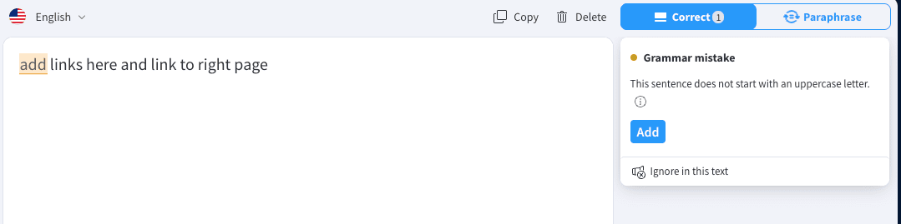
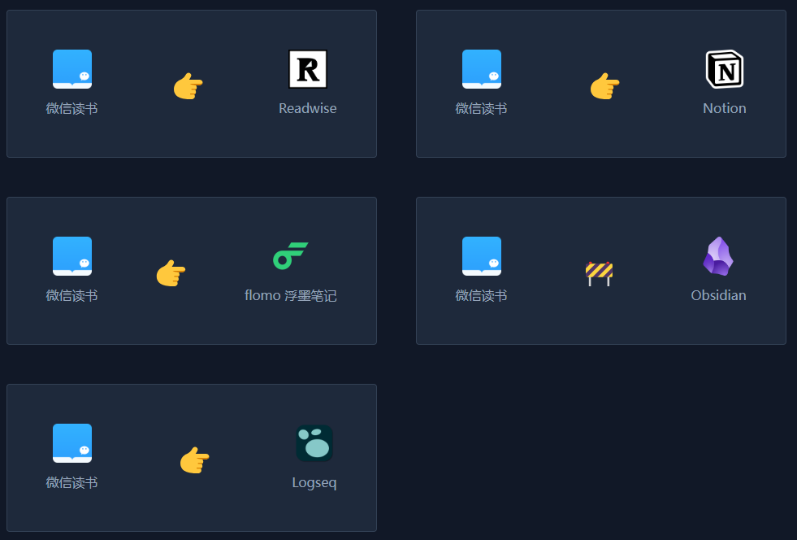
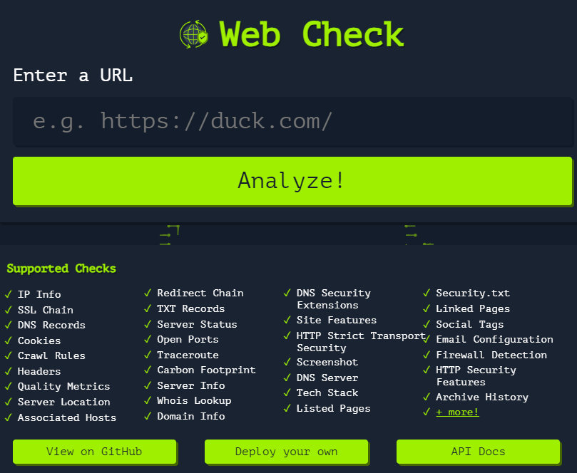
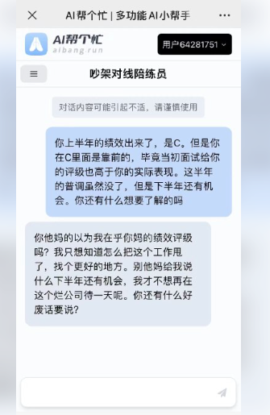

# 峨眉禅道

周末和亲戚朋友们去了峨眉的七里坪禅道，也许正是成都最热的时候，普通的周末也有很多人，不过和亲近的人一起游玩下还是很愉悦的。这里离峨眉索道不远，不过知道的人应该还不多，想避开攀登峨眉的大部队在附近登山打卡一下的话可以在这里试试。

# 技术见闻

## Protobuf 编码&避坑指南

> [https://www.luozhiyun.com/archives/800](https://www.luozhiyun.com/archives/800)

Protobuf 是 Google 开源的一种数据序列化协议，相比于 Json、xml 这些协议，采用了二进制的格式存储数据，可以获得更好的性能。在需要高性能的服务间通信等场景大量应用，我的工作中也有使用到的场景，这篇文章详细介绍了 Protobuf 的特性和开发中的注意事项，值得一读。

## MetaGPT：使用 GPTs 组成软件公司

> [https://github.com/geekan/MetaGPT](https://github.com/geekan/MetaGPT)

给 AI 输入一句话的老板需求，自动输出用户故事 / 竞品分析 / 需求 / 数据结构 / APIs / 文件等信息。MetaGPT 内部包括产品经理 / 架构师 / 项目经理 / 工程师，帮你组建了一个软件公司来完成你的需求。不知道以后会不会有帮这样的 AI 打工成功商业化的例子，到时是生产力的大爆发还是离 AI 取代人类更近了一步呢。

## **一人公司方法论**

> [https://github.com/easychen/one-person-businesses-methodology](https://github.com/easychen/one-person-businesses-methodology)

ServerChan 作者 easychen 编写的一人公司方法论，easychen 应该算是国内小有成就的个人开发者了，他的 Sever 酱，pushdeer 推送方案用户应该不少，这里的思路可以学习下，配合上面的 MetaGPT 效果更佳。

## languagetool：语法校对

> [https://github.com/languagetool-org/languagetool](https://github.com/languagetool-org/languagetool)

一个开源的词法校对器，它会自动校对你输入文字的语法以及拼写，能有效地检测出拼写错误，以及语法问题。有点像之前 [grammarly](https://www.grammarly.com/) 这款语法检查工具的开源替代，说起 grammarly 这款软件，前几年它几乎是我电脑上的必备软件，但是 AI 功能火了之后，一下有了很多的替代，我也没有再用过这款软件了。

来源：[数据处理的那些事「GitHub 热点速览」](https://www.cnblogs.com/xueweihan/p/17592529.html)

## **DocHub：分享优质文档**

> [https://www.ftium4.com/ux-weekly-153.html](https://www.ftium4.com/ux-weekly-153.html)

一个搜罗了腾讯文档、飞书文档、Notion 等众多平台的公开分享的优质资料的文档网站。涵盖了技术、商业、艺术、学术等各个领域，构建了一座广博而深厚的知识库。

来源：[体验碎周报第 153 期（2023.7.31）](https://www.ftium4.com/ux-weekly-153.html)

## 同步微信读书笔记

> [https://notepal.randynamic.org/](https://notepal.randynamic.org/)

一款 chrome 浏览器插件，可以将微信读书的读书笔记一键同步笔记到各个笔记软件。对我这个微信读书的用户还是挺有用的。作者也介绍了这款插件的开发过程，并且表示三天就获得 1000 元的收益。[https://lutaonan.com/blog/my-extension-sold-1k-yuan/](https://lutaonan.com/blog/my-extension-sold-1k-yuan/)

来源：[体验碎周报第 154 期（2023.8.7）](https://www.ftium4.com/ux-weekly-154.html)

## 很酷的网络检查工具

> [https://web-check.xyz/](https://web-check.xyz/)

一个超级酷的网络检查工具「Web-Check」，可以用很 Hacker 的方式查看到一个网站几乎所有信息，如 IP 信息、SSL、DNS 记录、Cookies、域名信息、搜索爬行规则、服务器位置、重定向记录、开放端口、路由跟踪、DNS 安全扩展、网站性能、关联主机名等。

## 吵架对线培练员

> [https://aibang.run/chat/sb](https://aibang.run/chat/sb)

如果你是一个性格温的人，遇到不快的事情了想学习学习如何成为一个祖安选手，这个 AI 可以帮帮你，火力强劲，慎用…

# 生活杂谈

## 如何用英语思维思考

> [https://www.youtube.com/watch?v=SJOnhWiJArM](https://www.youtube.com/watch?v=SJOnhWiJArM)

学习英语的过程中一般会有一层翻译思维，也即先将自己想到的中文在脑袋里先翻译成英文再去思考，而非直接用英语去思考。Youtube 这个视频「如何用英语思考|不再需要翻译」讲述了 6 个转变思维，使用英文思考的思路。B 站链接：[https://www.bilibili.com/video/BV1mu411V7y8](https://www.bilibili.com/video/BV1mu411V7y8)

- Name objects around. 用英语描述周围，需要注意发音。
- Thinking in simple sentences. 用简单的句子表达自己，I'm ..
- Have small conversiontions with yourself in English. 与自己进行英语对话，每天坚持几分钟。30 天可以见证进步
- Change one of your everyday life things to English. 将每天日常的一项事务变成英文。日记、微博、英文新闻，晨思
- Keep track so you're doing it every day. 保持跟踪，确保每天在做
- Recap your day in English. 用英语回顾每一天
