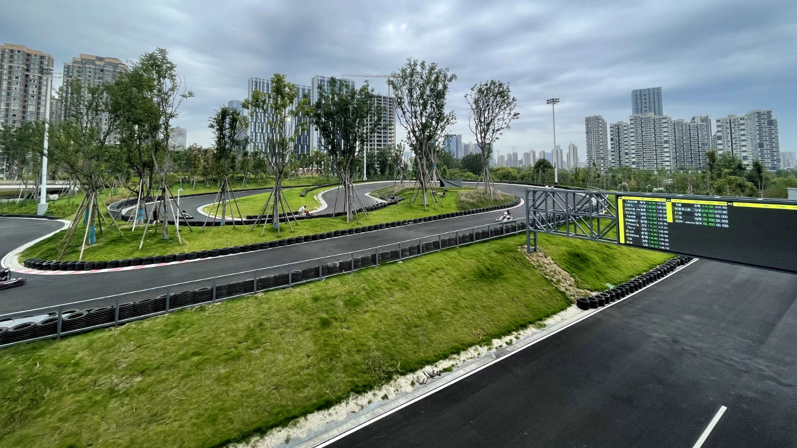

# 卡丁赛道

周末去附近的一个场地开了下卡丁车，这家公司最近应该是在抖音上打了不少广告，刷到了好几次，不过我本身还挺有兴趣，价格也不算贵，几十块钱可以跑四圈，跑道一圈有一公里多的样子，就来体验了一下。总体还算不错，赛道挺大，就是人有点多，排了一个多小时。卡丁车极速有个四五十码，安全防护措施挺到位的，可以小小的发泄一下速度与激情。

# 技术见闻

## 阮一峰的 TypeScript 教程

> [http://www.ruanyifeng.com/blog/2023/08/typescript-tutorial.html](http://www.ruanyifeng.com/blog/2023/08/typescript-tutorial.html)

JavaScript 是一门很万能的语言，特别是在 web 前端开发和各种跨平台客户端开发中都有广泛的应用，之前入门时看过阮一峰的《JavaScript 教程》，质量还不错，一直也想继续进阶下 TypeScript 来体验下带类型的 JavaScript，这次看到阮一峰老师新出了 TypeScript 教程，准备跟着学习一下。

## **简洁的 TypeScript 之书**

> [https://github.com/gibbok/typescript-book](https://github.com/gibbok/typescript-book)

虽然标题是简洁的 TypeScript，不过内容很丰富，涵盖了最新版本中的方方面面。完全可以单独当一本 ts 的参考手册来用，可以配合上面教程来一起使用，查漏补缺。

## **Nologin 提供保密的电子邮箱**

> [https://nlogin.me/](https://nlogin.me/)

Nologin 使用专用中继电子邮件地址隐藏您的电子邮件地址。可以理解成是一个中继邮箱，当我们使用这个中继邮箱注册各种服务账号时，验证码会先发送到这个中继邮箱，中继邮箱再发给你，很好的避免了泄露我们的真实邮箱。

来源：[产品鸭](https://produck.zhubai.love/posts/2302691740500840448)

## 神器集 发现最酷的互联网神器和工具

> [https://hao.logosc.cn/](https://hao.logosc.cn/)

一个发现分享有趣在线工具的地方。我是一个挺喜欢关注各类互联网工具的人，在这个生产力大爆发的时代，一个好的互联网工具可以提升不少的效率。看了下这个网站的内容还是很对我的胃口，丰富了不少我的工具库，如果你和有我一样此类的关注点的话可以看看这个网站。

[产品鸭](https://produck.zhubai.love/posts/2302691740500840448)中介绍此网站时，也分析了下此类网站的痛点和国内环境面对此类需求时真正需要的解决方案，很在理，也推荐去原文看看。

来源：[产品鸭](https://produck.zhubai.love/posts/2302691740500840448)

# 生活杂谈

## 数字游民

这周看了自己关注的博主一篇有关他远程工作的体验：[https://catcoding.me/p/remote-work/](https://catcoding.me/p/remote-work/)，想起了数字游民这个概念。第一次听说到数字游民这个词，是在微信公众号中偶然看到了一个《[数字游民空间 Dali Hub2.0 重新开业](https://mp.weixin.qq.com/s/I4CeWlWbsip_6RJViD8wWw)》的广告， 这个大理的办公空间聚集了一批可以一边远程工作赚钱一边周游旅行的人，在这个数字时代过着游牧搬的生活。可以一边旅行一边工作的生活真的是挺羡慕的，感觉这才是互联网工作者的理想形态，希望以后也能有这样的体验，姑且再给人生添加一个缥缈的小目标吧。

有关数字游民的详细讲解，推荐看看这篇《[什么是数字游民? - DN 终极扫盲贴](https://mp.weixin.qq.com/s?__biz=MzIyMjAwNzAzNg%3D%3D&mid=2650207755&idx=1&sn=2fc60aa69b13ae1b4d55fefbba72da75&chksm=f0364d98c741c48eff59cebdd9fcb1e416bea1369ca32191356413daf647e3ef39a0d8bcc670&scene=21#wechat_redirect)》文章，从概念到实现途径以及将要面临的困难都讲得很详细，感兴趣的小伙伴可以看看。
