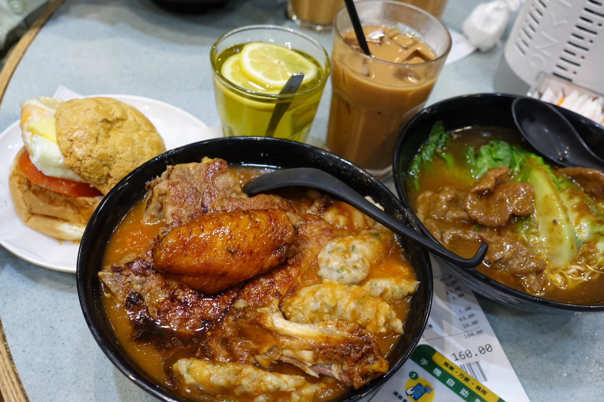

国庆的前几周, 趁着女友的一个工作空档, 顺便也想着避开下国庆的出行高峰, 提前请了几天假去香港游玩了一圈. 本是一场规划了几周的旅行, 想去的地方也很多, 沿途还准备顺便逛逛深圳, 但我们的行程只有四天, 注定得是一场特种兵式的打卡游. 而且很不巧的是, 出行的日子正好赶上了 “海葵” 台风降临, 天天都是瓢泼大雨 ,深圳和香港都淹了不少地方, 新闻更是称之为百年不遇的大雨, 每天起床看着窗外的大雨都想从心底大喊一声家人们, 谁懂啊 ~

大雨打乱了我们不少计划, 好在那几天充分发挥了特种兵精神, 用来都来了的口号坚定信心, 在凌乱中还是去了不少地方. 如今国庆也结束了, 生活逐渐回归日常, 也整理了下这场后劲挺大的打卡游.

# 漫步香港

一大早从深圳福田高铁到达香港的西九龙车站, 全程只要十几分钟, 我们订的酒店在红磡地铁站附近. 没办传说中在香港神通广大的八达通, 直接靠刷支付宝来到此地, 出地铁迎接的便是盛大的暴雨.

拜此所赐, 到达酒店后整个上午我们也无法出门, 只能待在酒店大堂盯着原本的出行计划望雨兴叹.直到快到中午雨稍微小了一点, 我们终于决定从行程备忘中选取了一家叫华嫂冰室的网红店, 决定从这去吃个午餐顺便开始一天探索.

当日的大雨让香港已经挂起了 ”黑旗” 的气象预警, 这是一种极端恶劣天气下的警告, 这也意味着香港当天将停工停课, 商场店铺虽然不受此限制, 但是大雨也淹了好几个地铁站, 交通受阻不少店员无法赶过来上班, 街边的商铺基本都关着门.

先在地图搜索到会展的一家华嫂冰室, 然而在到达后, 无例外的也关着大门, 好在出师不利的我们发现原来尖沙咀那边附近还有一家分店, 抱着试试看的心态折返回去后, 看到这家店还开着大门, 心情终于是好了不少, 此时天气也好转了些, 雨小了很多, 在这家店外面排队的人还不少.

冰室这个词听起来像是专门的冷饮店, 不过实际上店里菜单上的各类品种很多, 也许这就是港式茶餐厅的传统意义上的叫法吧. 在这家店里点了两份面, 一个鸡蛋夹心汉堡, 两杯饮品, 一共消费了 160 港币, 首次体会到了传说中的香港高物价. 味道嘛, 似乎和住家附近的那家港九茶餐厅大差不差, 牛肉更厚实, 鸡蛋更新鲜, 充分的给予身体碳水的愉悦, 然后再来一杯正宗加冰港式奶茶, 入口的一瞬间顿时让人清爽了不少.

顺带一提, 第二天寻找早餐时在酒店附近的商场发现了一家叫亚金南洋茶室的餐厅, 可以无门槛使用香港有礼消费券, 一顿丰盛的早餐只花了几块钱, 也许是这优惠从心理上提升了不少的体验, 吃起来口味感觉更好.

酒饱饭足, 行程伊始, 以下便是香港各处的打卡记录:

**维港伪成功人士来啦**

**天星小轮来啦**

**叮叮车来啦**

**中环来啦**

**铜锣湾来啦**

**坚尼地城来啦**

**乘缆车上太平山看夜景来啦**

# 奇妙迪士尼

迪士尼也是此行很期待的一站, 童年便一直听闻的传说中的乐园终于有机会来一睹风采了, 伴随着港铁的迪士尼专线中”愿你有个奇妙的一天”的广播, 来到了这个乐园. 依然是飘雨的一天, 好在只是断断续续的在下, 上午的花车巡演也没有取消, 气氛很到位.

**巡演中迪士尼的网红们**

迪士尼的游玩方式其实和我这直男想的很不一样, 我预想的应该是那种欢乐谷式的游玩方式, 主要打卡各种游乐设施, 顺便再观看下迪士尼的特色表演, 街边偶遇迪士尼角色玩偶的话再合个影, 就非常完美. 但也许是陪女友一起来的缘故, 这一天大部分时间实际上都是在排各种迪士尼网红的见面队伍, 从入园后便第一时间开始预约玲娜贝儿的见面会, 首先排的也是迪士尼角色见面项目 ”米奇会客厅” (第一批冲进园区, 也在这个项目排了接近一小时..), 下午在达菲的小屋前又是排了一个多小时才短短的见了一面这位人气网红时更是让我不得不有些怀疑人生.

**达菲和他的朋友们**

但直到我也遇到我这位偶像的见面会时, 理解了这种感觉.

**会晤钢铁侠**

钢铁侠的见面会也是排了很久的热门大项目, 入场时四五个人一起进入到小房间, 经过一个象征式的安全扫描仪式, 然后进入到会客厅, 会看到钢铁侠缓缓降落到门后, 像从电影中走出来一样和你打招呼, 整体非常有代入感, 顿时感觉排了这么久的还是值得的.

**通过扫描后钢铁侠炫酷出场**

讲真港迪中大部分的游乐设施刺激程度都比较温和, 大部分设施也就是合家欢的程度, 唯一的室外过山车灰熊矿车都不会出现翻滚的路段, 只是会有一段倒车的环节, 不知道的话第一次坐还挺容易吓一跳, 另外一个室内的星战过山车也只是胜在新奇, 论刺激程度的话相比成都欢乐谷那几个过山车应该都差远了. 来到这里沉浸式体验下各种迪士尼 IP 风格的场景, 和各路虚拟人物的近距离接触接触打个招呼, 有空再轻轻松松的玩个游乐设施, 其实才是正确的游玩方式吧.

最后, 终于现场欣赏到了迪士尼的烟花表演, 绚烂的烟花和灯光中看着各种熟悉的人物投影随着迪士尼特色的歌曲依次出现, 还是一件挺感动的事.

**迪士尼烟火收尾**

# 小结

通过深圳中转到达香港, 可以比直飞香港节省不少路费, 本来也想趁中转停留的机会好好看看这个传说中的卷城, 互联网从业者的圣地, 不过也是天气的原因, 只是短暂的瞥了几眼这里, 希望以后有机会再单独来这里逛逛.

香港这里有着自己独特的法规制度, 交通方式以及生活习惯, 初次旅行到这里仿佛出国了一次, 但是熟悉的面庞, 基本无碍的沟通又可以有着畅通无阻的体验. 看到各种曾经在港片中出现的风景, 来到这个似乎熟悉的城市, 有太多想去打卡的地方了. 短短几天的走马观花, 还有很多, 期待再来探索下不同的路线.

恶劣的天气对旅行影响的确很大, 但是也见识了很多不一样的风景, 同时压马路不会有大晴天那么累, 各处人流也没有平常那么多, 省了很多排队的时间, 这也是旅途中的独特的经历吧.

制定旅行路线时可以在地图上标记好, 查看起来就会一目了然, 方便很多. 遇到意外情况, 想舍弃一些地点时, 看看地图也可以快速取舍, 不至于乱了手脚.

保持在路上, 以上.
