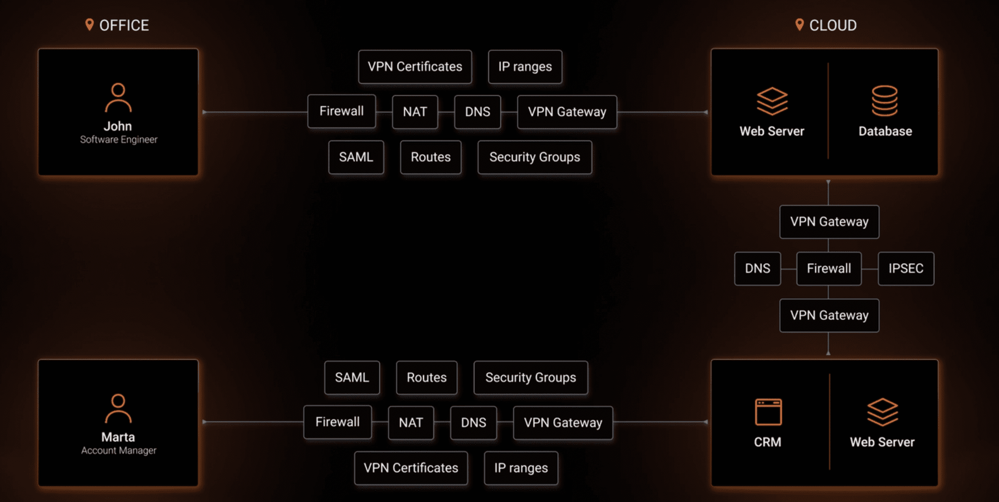
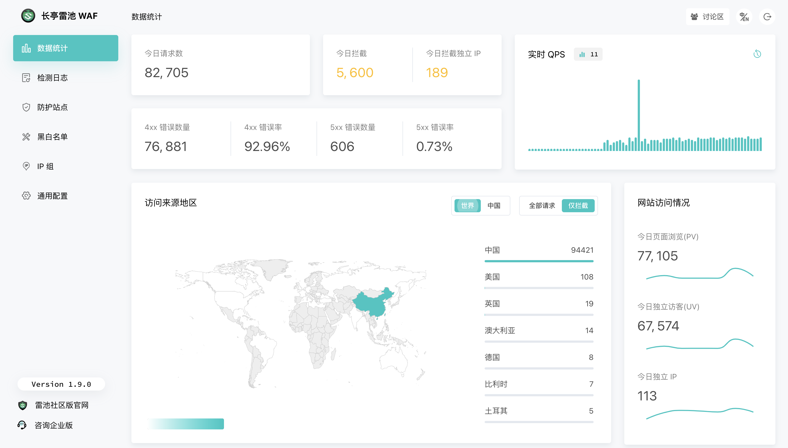

# 大足石刻


同学结婚，去了一趟重庆大足，顺道看了下有名的大足石刻。这里有很多关于宗教的雕刻，图中便是一个六道轮回的刻画，感觉很有寓意，佩服古人那种条件下还能创作出这样的作品。景区的石刻范围其实没多大，最多半小时应该就能逛完，不过感觉蕴含了许多的故事，可以找个导游或者提前做好功课再去看看，应该可以看出更多的门道。

# 技术见闻

## 开源 WireGuard 组网工具 **netbird**

> [https://github.com/netbirdio/netbird](https://github.com/netbirdio/netbird)



通过 SSO/MFA 和简单的访问控制，将设备连接到基于 WireGuard 的单一安全专用网状网络。又一款基于 WireGuard 的开源组网工具，与 Tailscale 很像，Tailscale 是在用户态实现了 WireGuard 协议，无法使用 WireGuard 原生的命令行工具来进行管理。而 NetBird 直接使用了内核态的 WireGuard，可以使用命令行工具 wg 来查看和管理。

## 国产开源 Web 防火墙雷池 WAF

> [https://github.com/chaitin/safeline](https://github.com/chaitin/safeline)



一款足够简单、足够好用、足够强的免费 WAF。基于业界领先的语义引擎检测技术，作为反向代理接入，保护你的网站不受黑客攻击。核心检测能力由智能语义分析算法驱动，专为社区而生，不让黑客越雷池半步。界面看起来不错，遇到此类需求时会考虑使用这个。

## 证件照转换 Idify

> [https://idify.netlify.app/](https://idify.netlify.app/)


将用户上传的人像照，转成证件照，全部使用前端代码，数据不会上传，代码也是开源的，不过需要科学上网。

## 浏览器切图

> [https://github.com/imgly/background-removal-js](https://github.com/imgly/background-removal-js)


使用浏览器轻松进行切图，和上面一样，全部使用本地代码，不会有隐私问题。试用了一下项目中的 [demo](https://img.ly/showcases/cesdk/background-removal/web)，效果还可以，就是速度有点慢，两三分钟才切好一张图。

## 将 SSH 保持连接

> [https://linuxiac.com/how-to-keep-ssh-session-alive/](https://linuxiac.com/how-to-keep-ssh-session-alive/)

```shell
# Client-Side Configuration (Linux)
nano ~/.ssh/config

Host *
ServerAliveInterval 120
ServerAliveCountMax 30

# Server-Side Configuration
sudo nano /etc/ssh/sshd_config

TCPKeepAlive yes
ClientAliveInterval 120
ClientAliveCountMax 30
```

你的工作是否也会频繁使用 SSH 连接各个服务器呢，作为 SSH 的重度使用者，有些环境使用 SSH 连接上去后一会没操作后就会自己断开，这篇英文博客详细分析了 SSH 不活动导致自动断开的原因，并给出了保持连接的客户端和服务端设置方法，试了下还挺有效的。

## 150+ 数字产品创意

> [https://ignacio-velasquez.notion.site/150-Digital-Products-Ideas-0b90ffd6021e4d8cbde96a617cd72cf7](https://ignacio-velasquez.notion.site/150-Digital-Products-Ideas-0b90ffd6021e4d8cbde96a617cd72cf7)


一份 notion 公开笔记，记录了 150+ 数字产品创意，想折腾折腾什么产品的话可以来这里寻找一些灵感。

# 生活杂谈

## 《走出戈壁》读后感

> [https://catcoding.me/p/out-of-the-gobi/](https://catcoding.me/p/out-of-the-gobi/)

关注的博主写了一篇《走出戈壁》的读后感，虽然没有读过这本书，但是感觉得到这本书的质量不错，跟着学习一些人生经验。

- 干什么事都要干好，否则闲着也是浪费时间，而且争强好胜，虽然身体瘦弱，但不甘人后，如此而已
- 所以抗搓能力非常重要，即使非常难过也得在人面前保持平静
- 在逆境中保持乐观、有所成长

## 妙瓦底生死 36 小时

> [https://weibo.com/ttarticle/p/show?id=2309404945990791856177](https://weibo.com/ttarticle/p/show?id=2309404945990791856177)


著名二次元艺术家峰哥的探险妙瓦底经历，整个过程还是挺惊险的，即使是整活也佩服峰哥的勇气，可以搭配 B 站的视频一起食用：[https://www.bilibili.com/video/BV14P41187bJ/](https://www.bilibili.com/video/BV14P41187bJ/)
