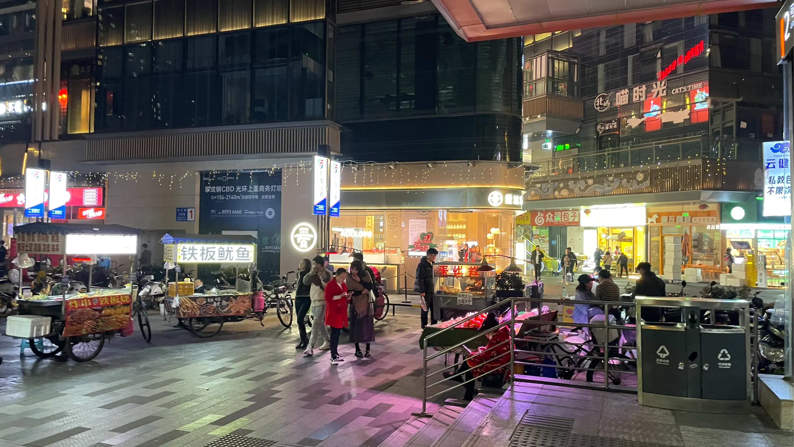
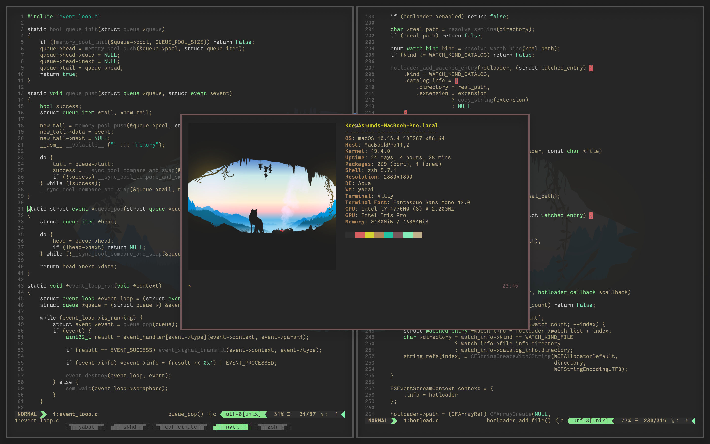
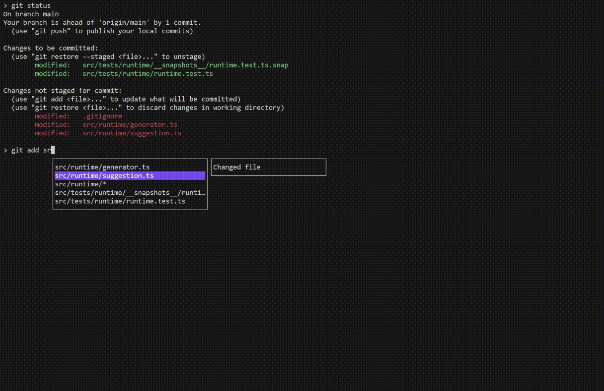

# 地铁口的烟火气

每天晚上下班出地铁口时，都能看到这些地铁口的流动小贩，光顾的顾客还挺多的，偶尔来了胃口也会在这些小摊中买个煎饼或者烧烤啥的填填肚子，冬日来临，伴随着这些喧嚣回家也有一种暖暖的烟火气。

# 技术见闻

## MacOS 窗口管理器 Yabai

> [https://github.com/koekeishiya/yabai](https://github.com/koekeishiya/yabai)

一款 MacOS 的窗口管理工具，用来作 macOS 内置窗口管理器的扩展。让你可用直观的命令行界面自由地控制你的窗口、空间和显示器，并可以搭配其他第三方软件设置用户定义的键盘快捷键。基于用二进制空间分割算法，通过它来管理你在 MacOS 的窗口布局，让你能够专注于窗口的内容而不受干扰。

## 终端命令提示工具 inshellisense

> [https://github.com/microsoft/inshellisense](https://github.com/microsoft/inshellisense)

一款为 shell 提供 IDE 级别的命令补全工具，由微软开源，已支持 600 多个命令行工具。支持 Windows、Linux 和macOS 全平台操作工具。

## **「及游册」技术架构大揭秘**

> [https://suoxing.noto.so/dev/travelog/arch](https://suoxing.noto.so/dev/travelog/arch)

一个独立开发团队的旅行笔记 APP 对自己技术架构的总结，对于跨平台技术，服务端的选型和思考，适合有类似想法的小伙伴的参考跟学习。

# 生活杂谈

## 2023 秋末四川行

> [https://lynan.cn/journey-to-sichuan-2023/](https://lynan.cn/journey-to-sichuan-2023/)

一位博主分享的 5 天四川旅行记录，包括了他选择的景点、交通方式、美景以及一些旅行的建议和总结。吸引我的一个是博主的拍摄的风景很不错，应该是位摄影爱好者，文中也有他的摄影技巧；另外就是看到他在毕棚沟、达谷冰川、九寨沟、黄龙这些景点中首推了毕棚沟，并且重来的话只想去毕棚沟待2天顺便住一晚上，看来是很赞了。作为一个在成都工作多年的人还一直没去这里看过，准备排上日程了。

## 小红书运营指南

小红书是目前很火的平台了，流量很大，口碑也不错，意味着有很多机会。相信很多人和我一样，想在小红书上塑造自己的 IP ，这里收集了一些官方指南可以学习学习。

- 小红书商家学习中心：[https://school.xiaohongshu.com/](https://school.xiaohongshu.com/)
- 小红书商业化学习中心：[https://e.xiaohongshu.com/](https://e.xiaohongshu.com/)
- 小红书种草学：[https://xue.xiaohongshu.com/](https://xue.xiaohongshu.com/)
