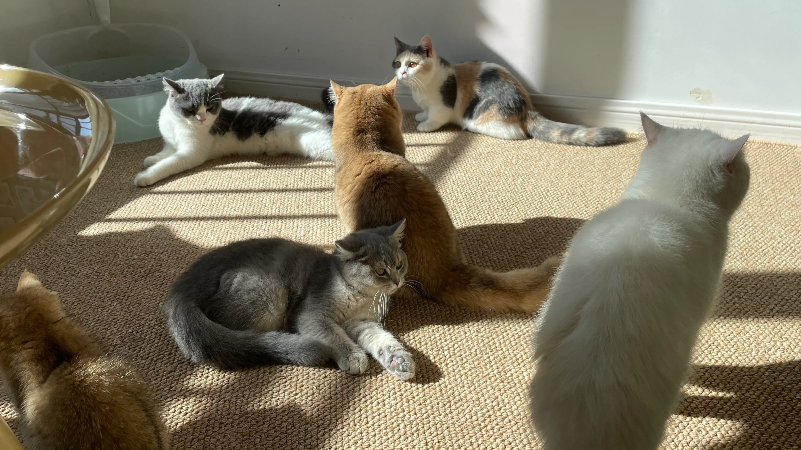

# 猫咖吸猫

冬日里难得出了点阳光，于是去了附近的一家猫咖来吸吸猫咪。和毛绒绒的可爱猫咪们待一会真的很治愈，这家猫咖的猫咪们也很会营业，好几只都会主动往怀里钻。不过吸久了还是有点副作用，大概是通风不太好，猫咪也比较多，回来便流了一晚上鼻涕。

# 技术见闻

## 根据草图和提示词实时生成图片 dynamic by fal

> [https://www.fal.ai/dynamic](https://www.fal.ai/dynamic)

现在已经有很多根据提示词和草图来生成图片的服务，新发现的这个工具在此基础上还可以一边改草图和提示词一边实时生成效果，速度挺快，所prompt即所得。

## 最懂程序员的新一代 AI 搜索引擎

> [https://devv.ai/](https://devv.ai/)

自从有了 chatGPT 之后，现在搜索技术问题基本靠问 AI，都不咋用谷歌了，AI 在回答一些基础明确的技术问题时的确挺是挺详细精准的，还可以跟他进一步讨论。这个网站是最近经常用的一个网站，针对程序员的领域进行了优化，国内也没有被墙，可以直接使用，速度挺快的。

另外也可以看看作者对这个产品的介绍，学习下做此类产品的理念：

[https://threadreaderapp.com/thread/1725332986042929198.html](https://threadreaderapp.com/thread/1725332986042929198.html)

## 超炫酷的量子纠缠实现效果

**原文**

[embed](https://twitter.com/i/status/1722543833408286927)

**B站链接**

[embed](https://player.bilibili.com/player.html?aid=706347882&bvid=BV1PQ4y1t7BT&cid=1341605659&p=1)

看到国外大神实现的一个超炫酷的量子纠缠效果，两个窗口的粒子互相纠缠然后合为一体的效果真的很赞。原理大致是通过 window.getScreenDetails() 获取窗口详细位置，然后通过 LocalStorage 共享窗口信息来实现的。

## Golang 数据库版本管理工具 goose

> [https://github.com/pressly/goose](https://github.com/pressly/goose)

日常功能开发中随着版本迭代，数据库肯定也会随之不断修改演进，通过这个工具，让数据库也具备版本管理的能力，记录每个版本的数据库变更，自动管理数据库模型的升级，也可回滚到某个指定版本，推荐在开发中使用。

## 万字详拆芯片：人类算力被锁死了吗？

> [https://sspai.com/post/83398](https://sspai.com/post/83398)

芯片还会进步吗？科技是不是停滞了？算力被锁死了吗？半导体还有希望吗？

少数派的一篇芯片相关科普文章，详细介绍了芯片算力的发展和当前的瓶颈，很硬核的科普。这些年来芯片发展是很热门的问题，如果你也和我一样有这些问题，可以在这篇文章中得到好好的解答。

# 生活杂谈

## 为什么要慢慢变富

> [https://letters.geekplux.com/51/](https://letters.geekplux.com/51/)

在 GEEKPLUX 的博文中读到了他关于慢慢变富的理念，他认为慢慢变富是在随机漫步的不确定中寻找那个确定性，并将财富增长归到了概率、确定性、长期、复利这些要点中。在这个节奏越来越快的社会中，随时还是免不了有一夜暴富的期望，但这篇文章也能给平凡的打工人一些思考。

## 怎样花两年时间去面试一个人

> [https://mindhacks.cn/2011/11/04/how-to-interview-a-person-for-two-years/](https://mindhacks.cn/2011/11/04/how-to-interview-a-person-for-two-years/)

来源于收藏夹里躺了很久的一位博主的十多年前文章，作者已经很久没有更新博客了，不过里面一些文章感觉还挺有意思，写的也挺长，偶尔会从收藏夹中翻出来看看。看到这篇文章，一个是作为跳槽过几次的打工仔和偶尔也面试下候选人的临时面试官，感叹下面试中面试者和面试官之间能相互能匹配还真是个不容易的事，一个是十多年后看到当年互联网行业快速发展时期对人才需求的旺盛，如今红利期已过大半，机会也少了很多，而且 AI 技术也迅猛发展，被 AI 挤掉饭碗的场景似乎也是很有可能的事了，到时估计也少了面试的烦恼，哈哈。

