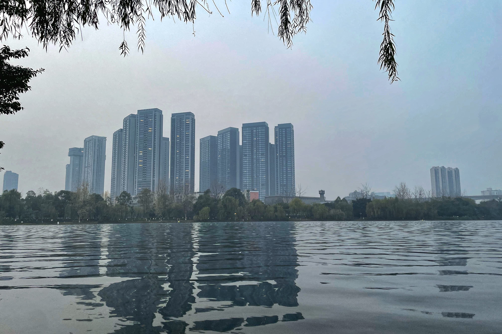
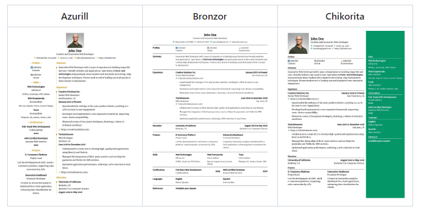
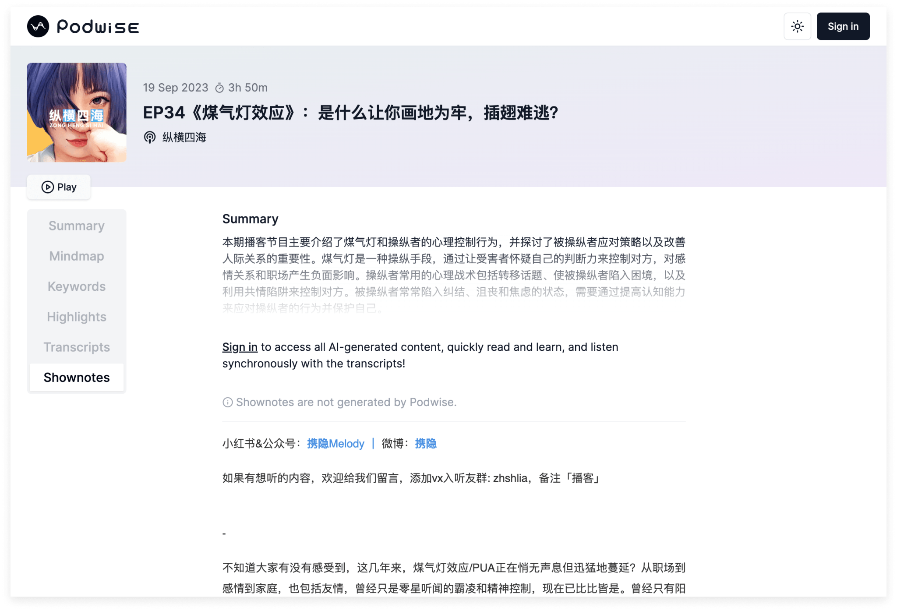

# 东湖公园





东湖公园是每天上班都会经过的一个站，离家也不远，这周末就顺便来这里逛了一下，风景不错，很多人在这里露营和拍照，一圈围湖的公路也适合跑步锻炼，是一个休闲的好去处。


# 技术见闻


## 集成 AI 的简历生成器


> [https://github.com/AmruthPillai/Reactive-Resume](https://github.com/AmruthPillai/Reactive-Resume)





一款免费的开源简历构建器，提供了友好方便的创建，更新和共享简历的过程。可以在官方平台中创建和管理自己的简历，也可以自托管。支持多种语言，数十个模板，即时编辑和拖放自定义组件并可以与 OpenAI 集成来通过 AI 改进自己的简历。创建完简历后，可以通过个性化链接与潜在的雇主共享，跟踪简历的浏览数据或下载，非常方便，可以不断的打磨自己的简历。


## 基于 AI 博客知识管理


> [https://podwise.xyz/](https://podwise.xyz/)





上下班的路上偶尔会听一些播客，不过听到了很多不错的内容也只是听完就过了，看到啊这个工具可以通过 AI 对播客内容进行 转录、提取、总结、分析等一系列操作，同时与 Notion、Readwise 等平台的打通，可谓是喜欢听播客的神器了，记录备用。


## 数据库迁移管理工具 migrate


> [https://github.com/golang-migrate/migrate](https://github.com/golang-migrate/migrate)


```shell
$ migrate -source file://path/to/migrations -database postgres://localhost:5432/database up 2
```


又看到一款Go的开源数据库数据迁移工具，有点类似于之前记录过的  [**goose**](https://github.com/pressly/goose)，后面有类似的需求时准备对比下这两款工具。


# 生活杂谈


## How to do great work


> [http://paulgraham.com/greatwork.html](http://paulgraham.com/greatwork.html)


很多人在推荐这篇 Paul Graham 的文章《How to Do Great Work》，Paul Graham 是 Y Combinator 的创始人之一，据说也是现在广为人知的 OpenAI CEO Sam Altman 的老师，这篇文章是他对伟大工作的认识。这篇文章挺长的，并没有读完，以下是AI对这篇文章的总结。中文翻译也可以看这篇 [https://zhuanlan.zhihu.com/p/640960574](https://zhuanlan.zhihu.com/p/640960574)

1. 确定要从事的工作：选择一个你天生适合、对其深感兴趣且具备做出伟大工作潜力的领域。
2. 独立项目的习惯：培养处理自己项目的习惯，不要只做别人要求你做的事情。做出伟大的工作很可能是在自己的项目中实现的。
3. 追寻兴趣和好奇心：寻找你过度好奇、对其他人来说可能无聊的领域。兴趣和好奇心将驱使你比仅凭勤奋更加努力地工作。
4. 学习并发现知识的边界：学习足够的知识，使自己接近领域的前沿，然后发现其中的知识空白。
5. 追求非传统想法：大胆追求非传统的想法，即使其他人对此不感兴趣。如果你对某种被忽视的可能性感到兴奋，并且具备足够的专业知识来指出其他人都忽视的问题，那就是一个很好的机会。
6. 勤奋和毅力：伟大的工作需要辛勤的付出。兴趣将比勤奋更能驱使你努力工作。
7. 选择合适的领域：不断尝试各种领域，选择自己感兴趣且独特的领域。不要担心与他人兴趣不同，奇特的兴趣通常会带来更好的生产力和新发现。
8. 追求自己想要的东西：制作满足自己需求的产品或服务。这样做可以吸引类似兴趣的人，帮助你建立初始受众。
9. 避免外界干扰和偷懒：保持长时间连续工作的状态，并设法避免中断。
10. 解决项目和日常拖延：停下来问自己是否在做自己最想做的事情，避免长期拖延。
11. 接受付出时间的重要性：把投入时间视为一种乐趣，而不是成本。工作应该足够吸引人，让你在其中感到兴奋。
12. 保持持续性：保持持续的努力，因为长期积累才能带来巨大成就。每天完成一些工作，而不是一无所获。

通过遵循以上解决方案，你可以更好地实现伟大的工作，并逐步实现自己的目标和野心。记住，兴趣、好奇心和毅力是成功的关键。

