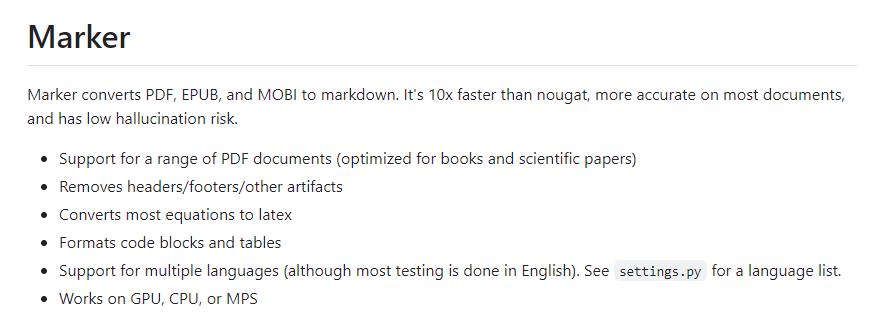
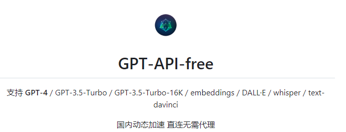
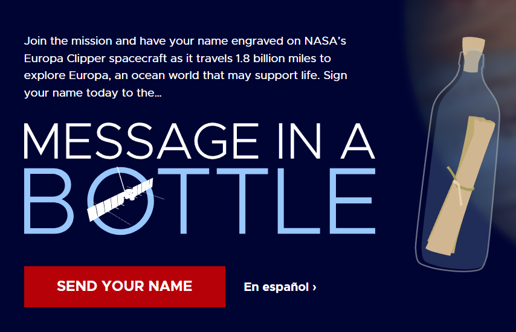

# 抱团取暖的蜥蜴

楼下宠物店新引进的蜥蜴，很少见到这类宠物，看起来倒是呆呆的。在程序员开发界，蜥蜴书常常是代表了各语言的指导书籍，质量很高，看看小蜥蜴，跟着它们一起掌握更多的知识吧。

# 技术见闻

## Blossom 开源双链笔记

> [https://github.com/blossom-editor/blossom](https://github.com/blossom-editor/blossom)

一款很有特色的双链笔记，支持 docker 一键部署。相比于另一款有名的开源双链笔记思源笔记，这款加入了计划安排，待办事项，番茄钟等特色功能，更像是一款双链笔记 + 效率工具的结合，如果想构建一款个人工作台，这个软件应该挺适合。

## Mac 终极武装教程

> [https://44maker.github.io/wiki/Mac/test.html](https://44maker.github.io/wiki/Mac/test.html)

很详细 Mac 教程，涵盖了从入门的上手验机到高阶的开发的配置方方面面。适合刚入手 Mac 的开发一步步熟悉自己的 Mac，熟手也可以当一部 Mac 相关问题的检索手册，看看遇到的问题在这里有没有合适的解决方法。

## Marker 将 PDF、EPUP、MOBI 转换为Markdown文件

> [https://github.com/VikParuchuri/marker](https://github.com/VikParuchuri/marker)

一款基于深度学习模型的转换工具，将 PDF、EPUP、MOBI 转换为 markdown 文档。通过文本提取、页面布局检测、文本清理和格式化等步骤，有效提升了文档转换的准确性，并针对书籍和论文进行了优化，支持去除页眉/页脚/其他文档痕迹，将方程式转换为 latex 格式，格式化代码块和表格，支持多种语言。

## GPT-API-free 提供免费的chatGPT key

> [https://github.com/chatanywhere/GPT_API_free](https://github.com/chatanywhere/GPT_API_free?tab=readme-ov-file)

为国内的个人用户提供免费的 chatGPT key 和中转 API，并包含了一定免费额度的 GPT-4 次数，对于需要轻度使用 GPT API 的用户可以通过这个项目获取免费的 Key，也可以配置到自己的一些对接了 GPT 的插件中使用。

## **Snowflake有什么问题及相关解决方案**

> [https://www.luozhiyun.com/archives/820](https://www.luozhiyun.com/archives/820)

Snowflake 是 X (twitter) 内部使用并在2014开源的分布式环境下的唯一 ID 生成算法，这篇文章介绍了 Snowflake 算法的实现原理和解决时间回拨问题的方案，包括等待时间追上、添加扩展位、直接拒绝报错等。同时还介绍了美团的 Leaf-snowflake 和百度的 UidGenerator 两种改进方案。分析的很不错，对 Snowflake 算法有了些新的认识。

# 生活杂谈

## 跟随木卫二一起登月

> [https://europa.nasa.gov/message-in-a-bottle/sign-on/](https://europa.nasa.gov/message-in-a-bottle/sign-on/)

NASA 的一个活动，可以点击这个链接填写上自己的名字，你的名字将伴随伴随 NASA 的 Europa Clipper 号飞船，航行2.9亿公里，前往木星轨道，一起探索木卫二这颗木星的冰冷卫星，这是一个可能有生命存在的海洋世界。 Europa Clipper 号飞船预计于2024年10月发射升空，发射窗口期21天，预计于2030年4月抵达。想在星辰大海的征途中留名么，可以先来这里登记一下。

## **人人都能用英语**

> [https://github.com/xiaolai/everyone-can-use-english](https://github.com/xiaolai/everyone-can-use-english)

李笑来在 GitHub 上开源的英语学习指南，李笑来是个争议很大的人物，不过作为原新东方的英语讲师，在英语学习理念上肯定还是有不少值得参考的地方。这本开源书籍不算长，在包含英语相关学习思路同时也穿插了很多李笑来自己的思维方式，了解下他的认知思路。

