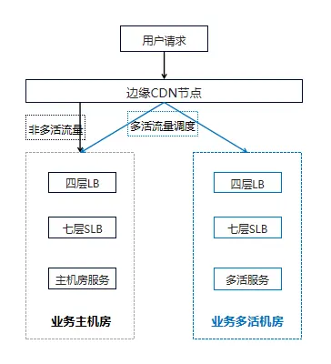

## 前言

前段时间看了B站发的[20210713网站崩溃事件](https://www.bilibili.com/read/cv17521097 "20210713网站崩溃事件") 的总结分析。小站崩掉的具体原因已在文章做了详细的分析，不过文章中多次提及了七层SLB、四层LB，这里LB指的便是 Load Balance 负载均衡，那么四层和七层负载均衡之间存在什么区别呢，这里进行一个学习总结。

## 四层负载均衡

四层负载均衡就是基于 IP + 端口的负载均衡，通过虚拟 IP + 端口接收请求，然后再分配到真实的服务器。

以常见的TCP为例，负载均衡设备在接收到第一个来自客户端的SYN 请求时，即通过上述方式选择一个最佳的服务器，并对报文中目标IP地址进行修改(改为后端服务器IP），直接转发给该服务器。TCP的连接建立，即三次握手是客户端和服务器直接建立的，负载均衡设备只是起到一个类似路由器的转发动作。在某些部署情况下，为保证服务器回包可以正确返回给负载均衡设备，在转发报文的同时可能还会对报文原来的源地址进行修改。

### 优缺点

*   优点：不对数据进行完全解析，不跟客户端建立连接（握手），请求分发的效率快。

*   缺点：无法灵活的进行转发，负载的服务器必须部署的相同服务器，否则同一个请求信息可能获取的结果是不同的。

### 相关实现

*   F5：硬件负载均衡器，功能很好，但是成本很高

*   lvs：重量级的四层负载软件 &#x20;

*   nginx：轻量级的四层负载软件，带缓存功能，正则表达式较灵活 &#x20;

*   haproxy：模拟四层转发，较灵活

## 七层负载均衡

七层负载均衡就是基于 URL 等应用层信息的负载均衡，通过虚拟 URL 或主机名接收请求，然后再分配到真实的服务器。除了URL，也还可根据七层的URL、浏览器类别、语言来决定是否要进行负载均衡。

以常见的TCP为例，负载均衡设备如果要根据真正的应用层内容再选择服务器，只能先代理最终的服务器和客户端建立连接(三次握手)后，才可能接受到客户端发送的真正应用层内容的报文，然后再根据该报文中的特定字段，再加上负载均衡设备设置的服务器选择方式，决定最终选择的内部服务器。负载均衡设备在这种情况下，更类似于一个代理服务器。负载均衡和前端的客户端以及后端的服务器会分别建立TCP连接。所以从这个技术原理上来看，七层负载均衡明显的对负载均衡设备的要求更高，处理七层的能力也必然会低于四层模式的部署方式。

### 优缺点

*   优点：可以将请求分发到不同的服务上，并且可以根据请求信息进行灵活的代理转发；由于请求会通过负载均衡服务器，负载均衡服务器会过滤一些请求（例如：DOS攻击）避免所有请求信息都打到服务器上，保障了服务器的稳定运行。

*   缺点：处于网络分层的最上层，需要对数据进行解析，与客户端建立连接，效率比较低。

### 相关实现

*   haproxy：天生负载均衡技能，全面支持七层代理，会话保持，标记，路径转移 &#x20;

*   nginx：只在http协议和mail协议上功能比较好，性能与haproxy差不多

*   apache：功能较差 &#x20;

*   Mysql proxy：功能尚可

## 四层和七层负载均衡对比

四层负载架构设计比较简单，无需解析具体的消息内容，在网络吞吐量及处理能力上会相对比较高，而七层负载均衡的优势则体现在功能多，控制灵活强大。

|      | 四层负載均衡          | 七层负载均偷                                   |
| ---- | --------------- | ---------------------------------------- |
| 基于   | 基于IP+Port       | 基于URL或主机IP等等                             |
| 类似于  | 路由器             | 代理服务器                                    |
| 握手次数 | 1               | 2                                        |
| 性能   | 高, 无需解析内容       | 中, 需要解析协议识别URL, Cookie 或 HTTP Header 等信息 |
| 安全性  | 低, 无法识别 DDoS等攻击 | 高, 可以防御SVN cookie 及SYN flood等攻击          |
| 额外功能 | 无               | 会话保持, 图片压缩, 防盗链等                         |

四层和七层负载均衡亦可结合使用，特别是对于存在流量很大的互联网企业，一般是先通过四层负载均衡，再通过七层负载均衡，充分发挥各层负载均衡的优势，例如B站的公网架构便是如此。

## 云原生的负载均衡

进入云原生时代，Web应用普遍会打包为容器并运行于 Kubernetes 之上，K8S 在设计之初就充分考虑了针对容器的服务发现与负载均衡机制，大致可以分为以下几种机制，每种机制都有其特定的应用场景：

*   Service：直接用 Service 提供 cluster 内部的负载均衡，并借助 cloud provider 提供的 LB 提供外部访问

*   Ingress Controller：还是用 Service 提供 cluster 内部的负载均衡，但是通过自定义 LB 提供外部访问

*   Service Load Balancer：把 load balancer 直接跑在容器中，实现 Bare Metal 的 Service Load Balancer

*   Custom Load Balancer：自定义负载均衡，并替代 kube-proxy，一般在物理部署 Kubernetes 时使用，方便接入公司已有的外部服务

当一个部署于K8S中的应用需要对外暴露时，一般会先创建关联此Pod的Service和Ingress，外部的流量会通过Ingress 到 Service 再转发对应的Pod。这是一种先七层再四层负载均衡的架构。Ingress 原生仅支持七层负载均衡，不过部分的 Ingress Controller 也实现了四层的负载均衡，如ingress-nginx等等，根据需要安装这些 Controller，也可在 Ingress 这一层实现四层负载均衡。
