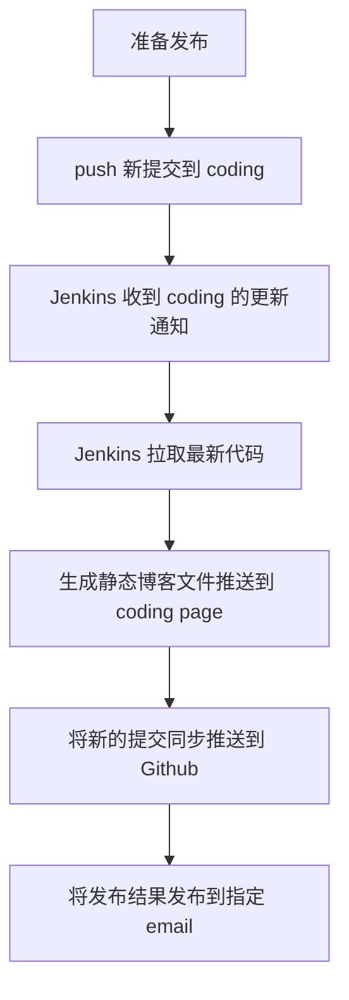

程序猿除了希望写好代码，一定也想着自己的项目可以如何快速的迭代上线，从而可以专注的完成代码的编写，减少繁杂的运维等工作。例如完成一项功能的开发后，推送到 Git 等代码管理系统后，剩下的测试、部署、上线等工作可以交给一个系统来自动化完成，这时便可以靠持续集成系统了。这里记录下我使用老牌的 Jenkins 持续集成系统来帮助自己完成的工作。
<!-- more -->

## 部署 Jenkins
### 使用 docker 部署 Jenkins
Jenkins 已有官方的 docker 镜像，通过 docker 可以快速完成 jenkins 系统的部署。

我使用的 Jenkins 部署命令:
```
docker run --name=jenkins -td -v jenkins_home:/var/jenkins_home -p 8080:8080 -p 50000:50000 -e JAVA_OPTS=-Duser.timezone=Asia/Shanghai jenkins/jenkins:lts
```
解释下各个运行选项
- --name=jenkins 将容器命名为 jenkins
- -td 分配一个伪 tty 终端，在后台运行
- -v jenkins_home:/var/jenkins_home 将 jenkins_home 存储卷挂载到容器 /var/jenkins_home，这样在删除或升级容器后数据也可以存在
- -p 8080:8080 -p 50000:50000 将容器的 8080 和 50000 端口映射到主机对应端口上
- -e JAVA_OPTS=-Duser.timezone=Asia/Shanghai 配置环境变量 JAVA_OPTS=-Duser.timezone=Asia/Shanghai 这样在 Jenkins 中显示的时区才是中国地区的

### nginx 反代设置
由于我在自己的域名下使用了 nginx 反代 Jenkins 端口，这里再分享下我的 nginx 配置
```
upstream jenkins {
    server 127.0.0.1:8080 fail_timeout=0;
}

server {
    listen 80;
    server_name your.site.com;
    return 301 https://your.site.com$request_uri;
}

server {
    listen 443 ssl http2;
    server_name your.site.com;

    location / {
      proxy_set_header        Host $host:$server_port;
      proxy_set_header        X-Real-IP $remote_addr;
      proxy_set_header        X-Forwarded-For $proxy_add_x_forwarded_for;
      proxy_set_header        X-Forwarded-Proto $scheme;

      # Fix the "It appears that your reverse proxy set up is broken" error.
      proxy_pass          http://jenkins;
      proxy_redirect      http:// https://;

      # Required for new HTTP-based CLI
      proxy_http_version 1.1;
      proxy_request_buffering off;
      # workaround for https://issues.jenkins-ci.org/browse/JENKINS-45651
      add_header 'X-SSH-Endpoint' 'your.site.come:50022' always;
    }
}
```

### 初始化 Jenkins
第一次安装 Jenkins 后，进入网页还需要配置下 Jenkins 的首次运行设置。基本上按默认的一直点下一步就可以了，网上教程也很多，有问题可以自行搜索。

## 配置持续集成项目
Jenkins 搭建完毕后，这里就详细演示下的通过 Jenkins 来完成发布基于 hexo 的博客的一系列流程。

### 为何需要 Jenkins
我基于 hexo 搭建了一个博客，博客代码托管于 Github，生成的静态内容托管于 coding page，在没有 Jenkins 的情况下，常常为以下问题感觉不爽：
1. 博客更新后推送到 Github 的速度总是很慢，没有使用国内代码托管平台那样的流程体验
2. 每次想发布博客时，还需手动执行一下 `hexo deploy` 命令，我只想把最新的更新推送到 Git 上后就不再管了

这时候 Jenkins 便派上用场了，以上这些都可以交给它来自动完成。整个发布流程如下：


### 配置 Jenkins 持续集成任务
#### 安装插件
Jenkins 在安装时已附带了常用的插件，由于这需要接收 coding 的推送通知和生成 hexo 静态文件，因而需要 `Coding Webhook` 和 `NodeJS` 这两个插件。可以在 `Jenkins 首页 -> 系统管理 -> 插件管理` 中选择安装。

#### 配置 Jenkins
为了让 Jenkins 有权限拉取和推送代码，需要为 Jenkins 生成一个拉取代码的 ssh 密钥，并添加到代码项目中。生成 ssh 密钥的方法很多，一般可以在 Liunx 系统通过
`ssh-keygen -t rsa` 来创建，创建好后添加到 `系统管理 -> 凭据 -> 系统 -> 全局凭据` 中，使每个项目都可以使用。之后还需将公钥添加到对应的 Git 项目中。


为了可以编译 hexo 项目生成静态项目，还需要配置 NodeJS 插件生成 hexo 插件运行环境。可在 `系统管理 -> 全局工具配置` NodeJS 配置项中按如下配置添加 NodeJS 10.14.2 运行环境，并自动安装 hexo。


#### 配置任务
在完成一系列的准备工作后，可以创建执行具体流程的任务了。点击首页左侧的新任务，输入一个喜欢的任务名，选择构建一个自由风格的软件项目。在 General 选项页面，可以配置丢弃旧的构建节省空间。


Source Code Management 选项页面需要配置托管代码的 Git 地址，这里因为我们想配置 Jenkins 自动推送代码到 Github，因而需要配置两个地址。


Build Triggers 选项页面需要配置何时触发这个项目，这里我们配置为通过 coding webhook 来触发。每次推送代码后，coding 便会通过一个 webhook 来通知 Jenkins 开始执行任务。


之后在 coding 项目的 `设置 -> webhook` 页面配置好项目触发地址和条件。


Build Environment 选项页面配置任务所需的环境，这里由于由于 hexo deploy 时需要 push 静态页面到 coding，也需要之前 git 仓库认证的密钥文件，可以勾选 `Use secret text(s) or file(s)`，将密钥文件提取出来以备接下来使用。同时在这里配置 nodeJS 运行环境，并且勾选了在控制台打印信息中添加时间戳以便调试。


Build 选项页面配置任务需要执行的命令，这里配置好 hexo 生成静态页面和部署所需各项命令。


Post-build Actions 选项页面可配置任务执行前后需要执行的动作，这里我们便可以通过 Git Publisher 推送代码到 Github 中，并通过发送邮件告知任务执行结果。


## 后记
活用好此类持续集成工具，可以帮助我们完成开发流程中的很多事，极大的提升我们的开发效率。除了老牌的 Jenkins，现在也有很多新型的工具或平台可以更方便的完成这些配置。比如 [DaoCloud](https://www.daocloud.io/)，[cds](https://github.com/ovh/cds)，[drone](https://drone.io/), [flowci](https://github.com/FlowCI/flow-platform) 等等，可以挑一个最顺手的好好研究。
